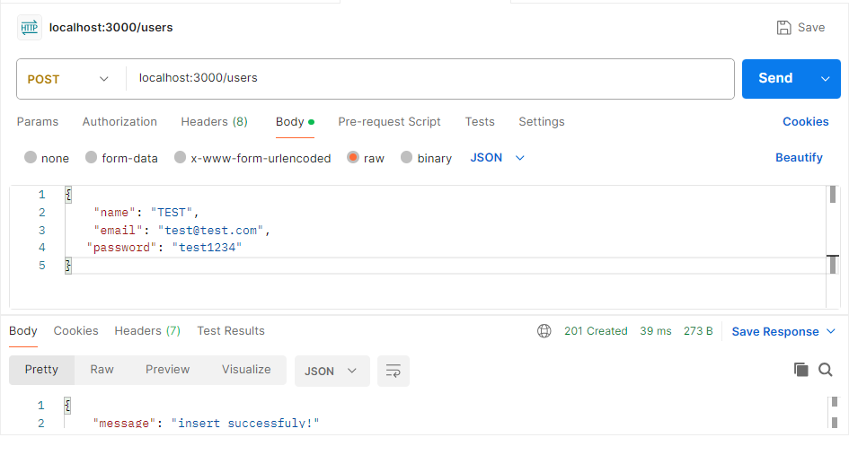

# Express에서 MySQL 연동

- 관계형 데이터베이스 연동 실습

# Node.js에서 MySQL 커넥션 실습

- 커넥션 풀 준비
- 로컬 PC에 MySQL이 구동 되어야 한다.

## DB연동을 위한 users 테이블 생성

- 테이블 생성 데이터 CRUD

```sql
# 테이블 생성
CREATE TABLE users (
ID INT NOT NULL AUTO_INCREMENT PRIMARY KEY,
NAME VARCHAR(100),
EMAIL VARCHAR(100),
PASSWORD VARCHAR(100) DEFAULT "1234"
);

ALTER TABLE users CHANGE password PASSWORD varchar(100) default '1234';

# 테이블 구조
DESC users;

# 데이터 삽입
INSERT INTO users (name, email) 
VALUES ('홍길동', 'hong@gmail.com');
# name, email, password 삽입
INSERT INTO users (name, email, password) 
VALUES ('홍길동', 'hong@gmail.com', '12345');

# 여러 데이터 한번에 입력
INSERT INTO users (name, email) 
VALUES 
('KIM', 'kim@gmail.com'),
('LEE', 'lee@gmail.com');

# 데이터 검색
SELECT * FROM users;
SELECT * FROM USERS WHERE ID=1;

# 데이터 수정
UPDATE USERS SET NAME='김길동', EMAIL='kim@naver.com' WHERE id=2;

# 데이터 삭제
DELETE FROM USERS WHERE ID=1;
```

# VS-Code에서 Node.js 앱 구현

```bash
npm init -y
npm i -S express cors ejs
```

## mysql2 패키지 설치

```bash
npm i -S mysql2
```

## MySQL DB 연동 커넥션 풀

```jsx
const mysql = require('mysql2');

const connection = mysql.createConnection({
    host: 'localhost',
    user: 'comstudy',
    password: 'comstudy',
    database: 'kosta285'
});

connection.connect( (err, handshake)=> {
    if(err) {
        console.log('DB 접속 Error: ', err);
        return;
    }
    console.log('DB Connect 성공!', handshake);
});
```

## DB커넥션 설정 파일 모듈

- config 폴더를 생성 하고 db.js 모듈 생성.

```jsx
// config/db.js
const mysql = require('mysql2');

const connection = mysql.createConnection({
    host: 'localhost',
    user: 'comstudy',
    password: 'comstudy',
    database: 'kosta285'
});

connection.connect( (err, handshake)=> {
    if(err) {
        console.log('DB 접속 Error: ', err);
        return;
    }
    //console.log('DB Connect 성공!', handshake);
    console.log('DB Connection 성공!');
});

module.exports = connection;
```

## app.js 파일에 router 기능 추가

- app.js에서 라우터를 만들고  DB CRUD 기능 추가
- express를 이용한 서버 구동.

```jsx
// app.js
const http = require('http');
const express = require('express');
const app = express();
const connection = require('./config/db');

const router = express.Router();

app.set('port', 3000);

// users 전체 목록 불러오기
router.route('/users').get((req, res)=> {
    const QUERY = 'SELECT * FROM USERS';
    function callback(err, results) {
        if(err) return res.status(500).json({error: err});
        res.send(results);
    };
    if(connection) {
        connection.query(QUERY, callback);
    } else {
        console.log('DB 연결 안됨!');
    }
});

app.use('/', router);
const server = http.createServer(app);
server.listen(app.get('port'), ()=>{
    console.log(`서버 실행 중 http://localhost:${app.get('port')}`);
})
```

### 브라우저 실행 결과

- 브라우저 주소창에 localhost:3000/users 실행

```json
// 20241010145500
// http://localhost:3000/users

[
  {
    "ID": 2,
    "NAME": "KIM",
    "EMAIL": "kim@naver.com",
    "PASSWORD": "1234"
  },
  {
    "ID": 3,
    "NAME": "LEE",
    "EMAIL": "lee@gmail.com",
    "PASSWORD": "1234"
  }
]
```

## app.js에 입력 기능 추가

```jsx
const http = require('http');
const express = require('express');
const app = express();
const connection = require('./config/db');

const router = express.Router();

app.set('port', 3000);

app.use(express.json());
app.use(express.urlencoded({extends: false}));

// users 전체 목록 불러오기
router.route('/users').get((req, res)=> {
    const QUERY = 'SELECT * FROM USERS';
    function callback(err, results) {
        if(err) return res.status(500).json({error: err});
        res.send(results);
    };
    if(connection) {
        connection.query(QUERY, callback);
    } else {
        console.log('DB 연결 안됨!');
    }
});

router.route('/users').post((req, res)=> {
    const {name, email, password} = req.body;
    const QUERY = 'INSERT INTO users (name, email, password) VALUES (?,?,?)';
    function callback(err, results) {
        if(err) return res.status(500).json({error: err});
        res.status(201).json({message: 'insert successfuly!'});
    };
    if(connection) {
        connection.query(QUERY, [name, email, password], callback);
    } else {
        console.log('DB 연결 안됨!');
    }
});

app.use('/', router);
const server = http.createServer(app);
server.listen(app.get('port'), ()=>{
    console.log(`서버 실행 중 http://localhost:${app.get('port')}`);
})
```

### Postman 으로 입력 기능 테스트



## CRUD 구현 전체 소스코드

```jsx
// app.js
const http = require('http');
const express = require('express');
const app = express();
const connection = require('./config/db');

const router = express.Router();

app.set('port', 3000);

app.use(express.json());
app.use(express.urlencoded({extends: false}));

const QUERY_SELECT = 'SELECT * FROM USERS ORDER BY ID DESC';
const QUERY_UPDATE = 'UPDATE USERS SET NAME=?, EMAIL=?, PASSWORD=? WHERE ID=?;';
const QUERY_INSERT = 'INSERT INTO users (name, email, password) VALUES (?,?,?)';
const QUERY_DELETE = 'DELETE FROM USERS WHERE ID=?';

// users 전체 목록 불러오기
router.route('/users').get((req, res)=> {
    function callback(err, results) {
        if(err) return res.status(500).json({error: err});
        res.send(results);
    };
    if(connection) {
        connection.query(QUERY_SELECT, callback);
    } else {
        console.log('DB 연결 안됨!');
    }
});

router.route('/users').post((req, res)=> {
    const {name, email, password} = req.body;
    function callback(err, results) {
        if(err) return res.status(500).json({error: err});
        res.status(201).json({message: 'insert successfuly!'});
    };
    if(connection) {
        connection.query(QUERY_INSERT, [name, email, password], callback);
    } else {
        console.log('DB 연결 안됨!');
    }
});

router.route('/users').put((req, res)=> {
    const {id, name, email, password} = req.body;
    function callback(err, results) {
        if(err) return res.status(500).json({error: err});
        res.redirect('/users');
    };
    if(connection) {
        connection.query(QUERY_UPDATE, [name, email, password, id], callback);
    } else {
        console.log('DB 연결 안됨!');
    }
});

router.route('/users').delete((req, res)=> {
    const {id} = req.body;
    function callback(err, results) {
        if(err) return res.status(500).json({error: err});
        res.status(201).json({message: 'insert successfuly!'});
    };
    if(connection) {
        connection.query(QUERY_DELETE, [id], callback);
    } else {
        console.log('DB 연결 안됨!');
    }
});

app.use('/', router);
const server = http.createServer(app);
server.listen(app.get('port'), ()=>{
    console.log(`서버 실행 중 http://localhost:${app.get('port')}`);
})
```