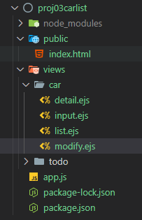

# Car List CRUD 구현

Express framework 공식 싸이트: [https://expressjs.com/ko/](https://expressjs.com/ko/)

- 폴더 구조
    - 가각 ejs 페이지를 만들고 app.js에서 router미들웨어를 이용해서 CRUD 기능 준비



- app.js

```jsx
const http = require("http");
const express = require("express");
const app = express();
const path = require("path");
const static = require("serve-static");
const router = express.Router();

app.set('port', 3000);
app.use("/", static(path.join(__dirname, "public") ) );

const carList = [
    {_id:1001, name:"GRANDEUR", price:3500, company:"HYUNDAI", year:2019},
    {_id:1002, name:"SONATA2", price:2500, company:"HYUNDAI", year:2022},
    {_id:1003, name:"BMW", price:5500, company:"BMW", year:2018},
    {_id:1004, name:"S80", price:4500, company:"VOLVO", year:2023}
];
// 목록
router.route("/car/list").get((req, res)=>{
    req.app.render('car/list',{}, (err, html) => {
        if (err) throw err;
        res.end(html);
    });
});
// 입력
router.route("/car/input")
.get((req, res)=>{
    req.app.render('car/input',{}, (err, html) => {
        if (err) throw err;
        res.end(html);
    });
})
.post();
// 상세 보기
router.route("/car/detail")
.get((req, res)=>{
    req.app.render('car/detail',{}, (err, html) => {
        if (err) throw err;
        res.end(html);
    });
})
.post();
// 수정
router.route("/car/modify")
.get((req, res)=>{
    req.app.render('car/modify',{}, (err, html) => {
        if (err) throw err;
        res.end(html);
    });
})
.post();
// 삭제
router.route("/car/delete")
.get((req, res)=>{
    req.app.render('car/delete',{}, (err, html) => {
        if (err) throw err;
        res.end(html);
    });
})
.post();

// 모든 라우터 설정이 완료 된 후에 미들웨어 등록해야 함.
app.use('/', router);
const server = http.createServer(app);
server.listen(app.get('port'), ()=>{
    console.log(`Run on Server >>> http://localhost:${app.get('port')}`);
});
```

- ejs 페이지에 include() 기능 사용


```html
<!DOCTYPE html>
<html lang="en">
<%- include("head.ejs") %>
<body>
    
    <h1>중고 자동차 목록</h1>
    <p><%- include("carmenu.ejs") %></p>
    <div>

    </div>
    <p><%- include("bottom.ejs") %></p>
</body>
</html>
```

## 부트 스트랩 적용

### 부트스트랩  CDN 준비

- head.ejs

```html
<head></head>
    <meta charset="UTF-8">
    <meta name="viewport" content="width=device-width, initial-scale=1.0">
    <title>Kosta nCar 전기차 쇼핑몰</title>
    <link rel="stylesheet" href="https://cdn.jsdelivr.net/npm/bootstrap@4.6.2/dist/css/bootstrap.min.css">
    <script src="https://cdn.jsdelivr.net/npm/jquery@3.7.1/dist/jquery.slim.min.js"></script>
    <script src="https://cdn.jsdelivr.net/npm/popper.js@1.16.1/dist/umd/popper.min.js"></script>
    <script src="https://cdn.jsdelivr.net/npm/bootstrap@4.6.2/dist/js/bootstrap.bundle.min.js"></script>
</head>
```

### 부트 스트랩 적용

```html
<nav class="navbar navbar-expand-sm bg-dark navbar-dark">
    <ul class="navbar-nav">
      <li class="nav-item">
        <a class="nav-link" href="/car/list">목록</a>
      </li>
      <li class="nav-item active">
        <a class="nav-link" href="/car/input">입력</a>
      </li>
      <li class="nav-item">
        <a class="nav-link" href="/car/modify">수정</a>
      </li>
      <li class="nav-item">
        <a class="nav-link" href="/car/detail">상세보기</a>
      </li>
      <li class="nav-item"></li>
        <a class="nav-link" href="/car/delete">삭제</a>
      </li>
    </ul>
  </nav>
<hr/>
```


# 입력 기능 구현

- bodyPaser 미들웨어 설치
- 파라미터를 가져온다.
- 파라미터 확인 후 carList에 저장
- 데이터 저장 후 carList페이지로 redirect

### body-paser 미들웨어 설치

```bash
npm i -S body-parser
```

### app에 미들웨어 등록

```jsx
const bodyPaser = require("body-parser");

app.use(bodyParser.urlencoded({extended:false}));
app.use(bodyParser.json());
```

### post 요청에서 파라미터 사용

```jsx
console.log(req.body);

req.body.name;
```

- app.js의 전체 소스 코드

```jsx
const http = require("http");
const express = require("express");
const app = express();
const path = require("path");
const static = require("serve-static");
const router = express.Router();
const bodyParser = require("body-parser");

app.set('port', 3000);
app.set("views", path.join(__dirname, "views") ); // prefix (ejs 페이지 경로)
app.set("view engine", "ejs"); // suffix (확장자)

app.use("/", static(path.join(__dirname, "public") ) );
app.use(bodyParser.urlencoded({extended:false}));
app.use(bodyParser.json());

const carList = [
    {_id:1001, name:"GRANDEUR", price:3500, company:"HYUNDAI", year:2019},
    {_id:1002, name:"SONATA2", price:2500, company:"HYUNDAI", year:2022},
    {_id:1003, name:"BMW", price:5500, company:"BMW", year:2018},
    {_id:1004, name:"S80", price:4500, company:"VOLVO", year:2023}
];
let seq_id = 1005;

// 목록
router.route("/car/list").get((req, res)=>{
    req.app.render('car/list',{carList}, (err, html) => {
        if (err) throw err;
        res.end(html);
    });
});
// 입력
router.route("/car/input")
    .get((req, res)=>{
        req.app.render('car/input',{}, (err, html) => {
            if (err) throw err;
            res.end(html);
        });
    })
    .post((req, res)=>{
        const newCar = {
            _id: seq_id++,
            name: req.body.name,
            price: req.body.price,
            company: req.body.company,
            year: req.body.year
        }
        carList.push(newCar);
        res.redirect("/car/list");
    });
// 상세 보기
router.route("/car/detail")
.get((req, res)=>{
    const index = carList.findIndex((car)=>{
        return car._id == req.query._id;
    });
    if(index != -1) {
        req.app.render('car/detail',{car: carList[index]}, (err, html) => {
            if (err) throw err;
            res.end(html);
        });
    } else {
        console.log("해당 요소를 찾을 수 없습니다!");
        res.redirect("/car/list");
    }
});
// 수정
router.route("/car/modify")
.get((req, res)=>{
    const index = carList.findIndex((car)=>{
        return car._id == req.query._id;
    });
    if(index != -1) {
        req.app.render('car/modify',{car: carList[index]}, (err, html) => {
            if (err) throw err;
            res.end(html);
        });
    } else {
        console.log("해당 요소를 찾을 수 없습니다!");
        res.redirect("/car/list");
    }
})
.post((req, res)=>{
    const index = carList.findIndex((car)=>{
        return car._id == req.body._id;
    });
    if(index != -1) {
        const newCar = {
            _id: req.body._id,
            name: req.body.name,
            price: req.body.price,
            company: req.body.company,
            year: req.body.year
        }
        carList[index] = newCar;
    }
    res.redirect("/car/list");
});
// 삭제
router.route("/car/delete")
.get((req, res)=>{
    const index = carList.findIndex((car)=>{
        return car._id == req.query._id;
    });
    if(index != -1) {
        carList.splice(index, 1);
    }
    res.redirect("/car/list");
});

// 모든 라우터 설정이 완료 된 후에 미들웨어 등록해야 함.
app.use('/', router);
const server = http.createServer(app);
server.listen(app.get('port'), ()=>{
    console.log(`Run on Server >>> http://localhost:${app.get('port')}`);
});
```

- views/list.ejs

```html
<!DOCTYPE html>
<html lang="en">
<%- include("head.ejs") %>
<body>
    <div class="container">
        <h1>중고 자동차 목록</h1>
        <p><%- include("carmenu.ejs") %></p>
        <div>
            <table class="table table-hover">
                <thead>
                    <tr>
                        <th>NO</th>
                        <th>NAME</th>
                        <th>PRICE</th>
                        <th>COMPANY</th>
                        <th>YEAR</th>
                    </tr>
                </thead>
                <tbody>
                <% carList.forEach((car, index)=>{ %>
                    <tr>
                        <td><%= index %></td>
                        <td>**<a href="/car/detail?_id=<%=car._id %>"><%= car.name %></a>**</td>
                        <td><%= car.price %></td>
                        <td><%= car.company %></td>
                        <td><%= car.year %></td>
                    </tr>
                <% })  %>
                </tbody>
            </table>
        </div>
        <p><%- include("bottom.ejs") %></p>
    </div>
</body>
</html>
```

- views/detail.ejs

```html
<!DOCTYPE html>
<html lang="en">
<%- include("head.ejs") %>
<body>
    <div class="container">
        <h1>자동차 상세 보기</h1>
        <p><%- include("carmenu.ejs") %></p>
        <div>
            <table class="table table-hover">
                <tbody>
                    <tr>
                        <th>ID</th>
                        <td><%= car._id %></td>
                    </tr>
                    <tr>
                        <th>NAME</th>
                        <td><%= car.name %></td>
                    </tr>
                    <tr>
                        <th>PRICE</th>
                        <td><%= car.price %></td>
                    </tr>
                    <tr>
                        <th>COMPANY</th>
                        <td><%= car.company %></td>
                    </tr>
                    <tr>
                        <th>YEAR</th>
                        <td><%= car.year %></td>
                    </tr>
                </tbody>
            </table>
            <nav class="navbar navbar-expand-sm bg-light navbar-light">
                <ul class="navbar-nav">
                  <li class="nav-item">
                    <a class="nav-link" href="/car/modify?_id=<%=car._id %>">수정</a>
                  </li>
                  <li class="nav-item"></li>
                    <a class="nav-link" href="/car/delete?_id=<%=car._id %>">삭제</a>
                  </li>
                </ul>
            </nav>
        </div>
        <p><%- include("bottom.ejs") %></p>
    </div>
</body>
</html>
```


## 수정 기능 구현

- modify.ejs

```html
<!DOCTYPE html>
<html lang="en">
<%- include("head.ejs") %>
<body>
    <div class="container">
        <h1>자동차 정보 수정</h1>
        <p><%- include("carmenu.ejs") %></p>
        <div>
            <form action="/car/modify" method="post" enctype="application/x-www-form-urlencoded">
                <input type="hidden" name="_id" value="<%=car._id%>">
                <table class="table table-hover">
                    <tbody>
                        <tr>
                            <th>NAME</th>
                            <td><input  class="form-control" type="text" name="name" value="<%=car.name %>"></td>
                        </tr>
                        <tr>
                            <th>PRICE</th>
                            <td><input  class="form-control" type="text" name="price" value="<%=car.price %>"></td>
                        </tr>
                        <tr>
                            <th>COMPANY</th>
                            <td><input  class="form-control" type="text" name="company" value="<%=car.company %>"></td>
                        </tr>
                        <tr>
                            <th>YEAR</th>
                            <td><input  class="form-control" type="text" name="year" value="<%=car.year %>"></td>
                        </tr>
                        <tr>
                            <td colspan="2">
                                <input class="btn btn-primary" type="submit" value="SAVE">
                            </td>
                        </tr>
                    </tbody>
                </table>
            </form>
        </div>
        <p><%- include("bottom.ejs") %></p>
    </div>
</body>
</html>
```

- app.js 수정 부분

```jsx
router.route("/car/modify")
.get((req, res)=>{
    const index = carList.findIndex((car)=>{
        return car._id == req.query._id;
    });
    if(index != -1) {
        req.app.render('car/modify',{car: carList[index]}, (err, html) => {
            if (err) throw err;
            res.end(html);
        });
    } else {
        console.log("해당 요소를 찾을 수 없습니다!");
        res.redirect("/car/list");
    }
})
.post((req, res)=>{
    const index = carList.findIndex((car)=>{
        return car._id == req.body._id;
    });
    if(index != -1) {
        const newCar = {
            _id: req.body._id,
            name: req.body.name,
            price: req.body.price,
            company: req.body.company,
            year: req.body.year
        }
        carList[index] = newCar;
    }
    res.redirect("/car/list");
});
```


## 삭제 기능 구현

- app.js 삭제 부분

```jsx
// 삭제
router.route("/car/delete")
.get((req, res)=>{
    const index = carList.findIndex((car)=>{
        return car._id == req.query._id;
    });
    if(index != -1) {
        carList.splice(index, 1);
    }
    res.redirect("/car/list");
});
```

## app.js 전체 소스 코드

```jsx
const http = require("http");
const express = require("express");
const app = express();
const path = require("path");
const static = require("serve-static");
const router = express.Router();
const bodyParser = require("body-parser");

app.set('port', 3000);
app.set("views", path.join(__dirname, "views") ); // prefix (ejs 페이지 경로)
app.set("view engine", "ejs"); // suffix (확장자)

app.use("/", static(path.join(__dirname, "public") ) );
app.use(bodyParser.urlencoded({extended:false}));
app.use(bodyParser.json());

const carList = [
    {_id:1001, name:"GRANDEUR", price:3500, company:"HYUNDAI", year:2019},
    {_id:1002, name:"SONATA2", price:2500, company:"HYUNDAI", year:2022},
    {_id:1003, name:"BMW", price:5500, company:"BMW", year:2018},
    {_id:1004, name:"S80", price:4500, company:"VOLVO", year:2023}
];
let seq_id = 1005;

// 목록
router.route("/car/list").get((req, res)=>{
    req.app.render('car/list',{carList}, (err, html) => {
        if (err) throw err;
        res.end(html);
    });
});
// 입력
router.route("/car/input")
    .get((req, res)=>{
        req.app.render('car/input',{}, (err, html) => {
            if (err) throw err;
            res.end(html);
        });
    })
    .post((req, res)=>{
        const newCar = {
            _id: seq_id++,
            name: req.body.name,
            price: req.body.price,
            company: req.body.company,
            year: req.body.year
        }
        carList.push(newCar);
        res.redirect("/car/list");
    });
// 상세 보기
router.route("/car/detail")
.get((req, res)=>{
    const index = carList.findIndex((car)=>{
        return car._id == req.query._id;
    });
    if(index != -1) {
        req.app.render('car/detail',{car: carList[index]}, (err, html) => {
            if (err) throw err;
            res.end(html);
        });
    } else {
        console.log("해당 요소를 찾을 수 없습니다!");
        res.redirect("/car/list");
    }
});
// 수정
router.route("/car/modify")
.get((req, res)=>{
    const index = carList.findIndex((car)=>{
        return car._id == req.query._id;
    });
    if(index != -1) {
        req.app.render('car/modify',{car: carList[index]}, (err, html) => {
            if (err) throw err;
            res.end(html);
        });
    } else {
        console.log("해당 요소를 찾을 수 없습니다!");
        res.redirect("/car/list");
    }
})
.post((req, res)=>{
    const index = carList.findIndex((car)=>{
        return car._id == req.body._id;
    });
    if(index != -1) {
        const newCar = {
            _id: req.body._id,
            name: req.body.name,
            price: req.body.price,
            company: req.body.company,
            year: req.body.year
        }
        carList[index] = newCar;
    }
    res.redirect("/car/list");
});
// 삭제
router.route("/car/delete")
.get((req, res)=>{
    const index = carList.findIndex((car)=>{
        return car._id == req.query._id;
    });
    if(index != -1) {
        carList.splice(index, 1);
    }
    res.redirect("/car/list");
});

// 모든 라우터 설정이 완료 된 후에 미들웨어 등록해야 함.
app.use('/', router);
const server = http.createServer(app);
server.listen(app.get('port'), ()=>{
    console.log(`Run on Server >>> http://localhost:${app.get('port')}`);
});
```

전체 소스 코드 : [https://github.com/comstudyschool/kosta202409/tree/main/proj03carlist](https://github.com/comstudyschool/kosta202409/tree/main/proj03carlist)