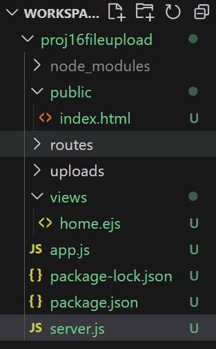

# 파일 업로드 & 파일 미리보기

# 파일 업로드

참고: [https://github.com/expressjs/multer/blob/master/doc/README-ko.md](https://github.com/expressjs/multer/blob/master/doc/README-ko.md)

## 파일 업로드에 사용되는 모듈

### 1) Formidable 모듈

- Node.js에서 사용되는 원시적인 파일 업로드 모듈
    - [https://www.w3schools.com/nodejs/nodejs_uploadfiles.asp](https://www.w3schools.com/nodejs/nodejs_uploadfiles.asp)

### 2) multer 모듈

- Node.js에서 가장 많이 사용되는 파일 업로드 모듈.
    - [https://github.com/expressjs/multer/blob/master/doc/README-ko.md](https://github.com/expressjs/multer/blob/master/doc/README-ko.md)

# Node.js 프로젝트 생성

- 의존성 모듈 설치

```bash
npm init -y
npm i -S express ejs cors
npm i -D nodemon
```

### 프로젝트 내부 구성

- server.js와 app.js 파일 분리
- public, views, uploads  폴더 준비

### app.js 준비

```jsx
const express = require('express');
const app = express();
const shopRouter = require('./routes/shop');

app.use("/", shopRouter);
module.exports = app;
```

### server.js 준비

- serve-static 미들웨어 : 최상위 모듈에서 미들웨어 등록 한다.
- uploads폴더와 public폴더를 static으로 설정.

```jsx
const http = require('http');
const shopApp = require('./app');
const express = require('express');

const mainApp = express();
mainApp.use('/shop', shopApp);
// app.js와  server.js로 분리 되었을 경우 최상위 모듈에 적용.
mainApp.use('/', express.static('public'));
mainApp.use('/uploads', express.static('uploads'));

const server = http.createServer(mainApp);
server.listen(3000, ()=>{
    console.log(`서버 실행 중 http://localhost:${3000}`);
});
```

### 라우터 모듈로 분리하기

```jsx
const express = require('express');
const router = express.Router();

router.route('/list').get((req, res)=>{
    res.end('GET - /shop/list 호출');
});

router.route('/input').post((req, res)=>{
    res.end('POST - /shop/input 호출');
});

module.exports = router;
```



## 파일 업로드 입력 폼

- /public/photo.html

```html
<!DOCTYPE html>
<html lang="en">
    <head>
        <meta charset="utf-8">
        <title>index</title>
    </head>
    <body>
        <h1>사진 업로드 폼</h1>
        <br>
        <form action="/shop/input" method="post" enctype="multipart/form-data">
            <table>
                <tr>
                    <td><label for="photo">파일</label></td>
                    <td><input type="file" name="photo" id="photo" multiple></td>
                </tr>
            </table>
            <input type="submit" value="업로드" name="전송">
        </form>
    </body>
</html>
```

## 파일 업로드 서버에 폴더 지정

- server.js

```bash
const http = require('http');
const shopApp = require('./app');
const express = require('express');

const mainApp = express();
mainApp.use('/shop', shopApp);
// app.js와  server.js로 분리 되었을 경우 최상위 모듈에 적용.
mainApp.use('/', express.static('public'));
mainApp.use('/uploads', express.static('uploads'));

const server = http.createServer(mainApp);
server.listen(3000, ()=>{
    console.log(`서버 실행 중 http://localhost:${3000}`);
});
```

- shop.js

```jsx
const express = require('express');
const router = express.Router();
const fs = require('fs');
const multer = require('multer');

var storage = multer.diskStorage({
    destination: function(req, file, callback) {
        callback(null, 'uploads');
    },
    filename: function(req, file, callback) {
        // 한글 파일 깨짐 방지
        const fileName = Buffer.from(file.originalname, 'latin1').toString('utf8');
        // 파일명 중복을 방지하기 위한 처리
        // Date.now() <-- 타임스템프
        let index = fileName .lastIndexOf(".");
        let newFileName = fileName .substring(0, index);
        newFileName += Date.now();
        newFileName += fileName .substring(index);
        callback(null, newFileName);
    }
});

const upload = multer({
    storage: storage,
    limits: {
        files: 10, // 최대 10개까지
        fileSize: 1024*1024*1024 // 1G
    }
});

router.route('/list').get((req, res)=>{
    res.end('GET - /shop/list 호출');
});

router.route('/input').post(upload.array('photo', 1), (req, res)=>{
    res.end('파일 업로드 성공!');
});

module.exports = router;
```

### 파일 업로드 완료 후 파일 정보 추출

```jsx
const express = require('express');
const router = express.Router();
const fs = require('fs');
const multer = require('multer');

var storage = multer.diskStorage({
    destination: function(req, file, callback) {
        callback(null, 'uploads');
    },
    filename: function(req, file, callback) {
        // 한글 파일 깨짐 방지
        const fileName = Buffer.from(file.originalname, 'latin1').toString('utf8');
        // 파일명 중복을 방지하기 위한 처리
        // Date.now() <-- 타임스템프
        let index = fileName .lastIndexOf(".");
        let newFileName = fileName .substring(0, index);
        newFileName += Date.now();
        newFileName += fileName .substring(index);
        callback(null, newFileName);
    }
});

const upload = multer({
    storage: storage,
    limits: {
        files: 10, // 최대 10개까지
        fileSize: 1024*1024*1024 // 1G
    }
});

router.route('/list').get((req, res)=>{
    res.end('GET - /shop/list 호출');
});

router.route('/input').post(upload.array('photo', 1), (req, res)=>{
    console.log('/process/photo 호출됨.');
	try {
		var files = req.files;
	
		console.dir('#===== 업로드된 첫번째 파일 정보 =====#')
		console.dir(req.files[0]);
		console.dir('#=====#')
        
		// 현재의 파일 정보를 저장할 변수 선언
		var originalname = '',
		filename = '',
		mimetype = '',
		size = 0;
		
		if (Array.isArray(files)) {  
            // 배열에 들어가 있는 경우 (설정에서 1개의 파일도 배열에 넣게 했음)
            console.log("배열에 들어있는 파일 갯수 : %d", files.length);
            for (var index = 0; index < files.length; index++) {
                originalname = files[index].originalname;
                filename = files[index].filename;
                mimetype = files[index].mimetype;
                size = files[index].size;
            } // end of  for
        } else{
            // else  부분 계속 이어서 작성 ....
            // 배열에 들어가 있지 않은 경우 (현재 설정에서는 해당 없음)
            console.log("파일 갯수 : 1 ");

            originalname = files[index].originalname;
            filename = files[index].name;
            mimetype = files[index].mimetype;
            size = files[index].size;
        } // end  of  if~else
    
        console.log('현재 파일 정보 : ' + originalname + ', ' + filename + ', ' + mimetype + ', ' + size);
        // 클라이언트에 응답 전송
        res.writeHead('200', {'Content-Type':'text/html;charset=utf8'});
        res.write('<h3>파일 업로드 성공</h3>');
        res.write('<hr/>');
        res.write('<p>원본 파일명 : ' + originalname + ' -> 저장 파일명 : ' + filename + '</p>');
        res.write('<p>MIME TYPE : ' + mimetype + '</p>');
        res.write('<p>파일 크기 : ' + size + '</p>');
        res.end();
    } catch(err) {
        console.dir(err.stack);
    } // end of try~catch	
});

module.exports = router;
```

### 입력 폼에 기타 정보 추가

- 입력 폼에 작성자, 설명 등의 기타 정보 입력 추가.

```jsx
<!DOCTYPE html>
<html lang="en">
    <head>
        <meta charset="utf-8">
        <title>index</title>
    </head>
    <body>
        <h1>사진 업로드 폼</h1>
        <br>
        <form action="/shop/input" method="post" enctype="multipart/form-data">
            <table>
                <tr>
                    <td>작성자</td>
                    <td><input type="text" name="writer" value="hong"/></td>
                </tr>
                <tr>
                    <td>설명</td>
                    <td><input type="text" name="comment" value="길동이가 올린 파일"/></td>
                </tr>
                <tr>
                    <td><label for="photo">파일</label></td>
                    <td><input type="file" name="photo" id="photo" multiple></td>
                </tr>
            </table>
            <input type="submit" value="업로드" name="전송">
        </form>
    </body>
</html>
```


### 서버에 기타 정보 전달

- 서버에서 기타 정보를 파라미터에서 추출한다.
- post 요청이기 때문에  body-parser 미들웨어 설정 필요.
- req.body에서 파라미터 데이터 추출
- 파일에 관련된 정보는 req.files에 들어 있다.
- 한글 파일명 깨짐 처리 : Buffer.from(originalname, 'latin1').toString('utf8')

```jsx
const express = require('express');
const router = express.Router();
const fs = require('fs');
const multer = require('multer');

var storage = multer.diskStorage({
    destination: function(req, file, callback) {
        callback(null, 'uploads');
    },
    filename: function(req, file, callback) {
        // 한글 파일 깨짐 방지
        const fileName = Buffer.from(file.originalname, 'latin1').toString('utf8');
        // 파일명 중복을 방지하기 위한 처리
        // Date.now() <-- 타임스템프
        let index = fileName .lastIndexOf(".");
        let newFileName = fileName .substring(0, index);
        newFileName += Date.now();
        newFileName += fileName .substring(index);
        callback(null, newFileName);
    }
});

const upload = multer({
    storage: storage,
    limits: {
        files: 10, // 최대 10개까지
        fileSize: 1024*1024*1024 // 1G
    }
});

router.route('/list').get((req, res)=>{
    res.end('GET - /shop/list 호출');
});

router.route('/input').post(upload.array('photo', 1), (req, res)=>{
    console.log('/process/photo 호출됨.');
    // server.js에 bodyParser 미들웨어 설정
    console.log(req.body);
	try {
		var files = req.files;
	
		console.dir('#===== 업로드된 첫번째 파일 정보 =====#')
		console.dir(req.files[0]);
		console.dir('#=====#')
        
		// 현재의 파일 정보를 저장할 변수 선언
		var originalname = '',
		filename = '',
		mimetype = '',
		size = 0;
		
		if (Array.isArray(files)) {  
            // 배열에 들어가 있는 경우 (설정에서 1개의 파일도 배열에 넣게 했음)
            console.log("배열에 들어있는 파일 갯수 : %d", files.length);
            for (var index = 0; index < files.length; index++) {
                originalname = files[index].originalname;
                filename = files[index].filename;
                mimetype = files[index].mimetype;
                size = files[index].size;
            } // end of  for
        } else{
            // else  부분 계속 이어서 작성 ....
            // 배열에 들어가 있지 않은 경우 (현재 설정에서는 해당 없음)
            console.log("파일 갯수 : 1 ");

            originalname = files[index].originalname;
            filename = files[index].name;
            mimetype = files[index].mimetype;
            size = files[index].size;
        } // end  of  if~else
    
        console.log('현재 파일 정보 : ' + Buffer.from(originalname, 'latin1').toString('utf8') + ', ' + filename + ', ' + mimetype + ', ' + size);
        // 클라이언트에 응답 전송
        res.writeHead('200', {'Content-Type':'text/html;charset=utf8'});
        res.write('<h3>파일 업로드 성공</h3>');
        res.write('<hr/>');
        res.write('<p>원본 파일명 : ' + Buffer.from(originalname, 'latin1').toString('utf8') + ' -> 저장 파일명 : ' + filename + '</p>');
        res.write('<p>MIME TYPE : ' + mimetype + '</p>');
        res.write('<p>파일 크기 : ' + size + '</p>');
        res.write('<p>작성자 : ' + req.body.writer + '</p>');
        res.write('<p>설명 : ' + req.body.comment + '</p>');
        res.end();
    } catch(err) {
        console.dir(err.stack);
    } // end of try~catch	
});

module.exports = router;
```

- 브라우저에서 처리 결과 확인


## 지저분한 코드 최적화 하기

- /routes/shop.js

```jsx
const express = require('express');
const router = express.Router();
const fs = require('fs');
const multer = require('multer');

var storage = multer.diskStorage({
    destination: function(req, file, callback) {
        callback(null, 'uploads');
    },
    filename: function(req, file, callback) {
        // 한글 파일 깨짐 방지
        const fileName = Buffer.from(file.originalname, 'latin1').toString('utf8');
        // 파일명 중복을 방지하기 위한 처리
        // Date.now() <-- 타임스템프
        let index = fileName .lastIndexOf(".");
        let newFileName = fileName .substring(0, index);
        newFileName += Date.now();
        newFileName += fileName .substring(index);
        callback(null, newFileName);
    }
});

const upload = multer({
    storage: storage,
    limits: {
        files: 10, // 최대 10개까지
        fileSize: 1024*1024*1024 // 1G
    }
});

router.route('/list').get((req, res)=>{
    res.end('GET - /shop/list 호출');
});

// 코드 최적화
router.route('/input').post(upload.array('photo', 1), (req, res) => {
    console.log('/process/photo 호출됨.');
    console.log(req.body);

    try {
        const files = req.files;

        if (!files || files.length === 0) {
            res.status(400).send('파일이 업로드되지 않았습니다.');
            return;
        }

        const file = files[0]; // 첫 번째 파일만 처리 (업로드된 파일은 최대 1개)

        // 파일 정보
        const originalname = file.originalname;
        const filename = file.filename;
        const mimetype = file.mimetype;
        const size = file.size;

        console.log(`업로드된 파일: 원본 파일명 - ${Buffer.from(originalname, 'latin1').toString('utf8')}, 저장 파일명 - ${filename}, MIME TYPE - ${mimetype}, 파일 크기 - ${size}`);

        // 클라이언트에 응답 전송
        res.status(200).contentType('text/html;charset=utf8').send(`
            <h3>파일 업로드 성공</h3>
            <hr/>
            <p>원본 파일명: ${Buffer.from(originalname, 'latin1').toString('utf8')} -> 저장 파일명: ${filename}</p>
            <p>MIME TYPE: ${mimetype}</p>
            <p>파일 크기: ${size}</p>
            <p>작성자: ${req.body.writer}</p>
            <p>설명: ${req.body.comment}</p>
        `);
    } catch (err) {
        console.error('파일 처리 중 오류 발생:', err);
        res.status(500).send('서버 오류로 파일 업로드에 실패했습니다.');
    }
});

module.exports = router;
```

## 실행 결과를 뷰템플릿에 보이도록 변경

- /views/FileUploadResult.ejs

```html
<!DOCTYPE html>
<html lang="en">
    <head>
        <meta charset="utf-8">
        <title>index</title>
    </head>
    <body>
        <h1>파일 업로드 결과</h1>
        <hr/>
        <p>원본 파일명: <%=result.originalname %> 
            -> 저장 파일명: <%=result.filename %></p>
        <p>MIME TYPE: <%=result.mimetype %></p>
        <p>파일 크기: <%=result.size %></p>
        <p>작성자: <%=result.writer %></p>
        <p>설명: <%=result.comment %></p>
    </body>
</html>
```

- /routes/shop.js

```jsx
const express = require('express');
const router = express.Router();
const fs = require('fs');
const upload = require('./multerStorage');

router.route('/list').get((req, res)=>{
    res.end('GET - /shop/list 호출');
});

// 코드 최적화
router.route('/input').post(upload.array('photo', 1), (req, res) => {
    console.log('/process/photo 호출됨.');
    console.log(req.body);

    try {
        const files = req.files;

        if (!files || files.length === 0) {
            res.status(400).send('파일이 업로드되지 않았습니다.');
            return;
        }

        const file = files[0]; // 첫 번째 파일만 처리 (업로드된 파일은 최대 1개)

        // 파일 정보
        const originalname = file.originalname;
        const filename = file.filename;
        const mimetype = file.mimetype;
        const size = file.size;

        console.log(`업로드된 파일: 원본 파일명 
            - ${Buffer.from(originalname, 'latin1').toString('utf8')}, 
            저장 파일명 - ${filename}, 
            MIME TYPE - ${mimetype}, 
            파일 크기 - ${size}`);

        const resultData = {
            originalname: Buffer.from(originalname, 'latin1').toString('utf8'),
            mimetype : mimetype,
            size: mimetype,
            writer: req.body.writer,
            comment: req.body.comment
        }

        // ejs모듈 설치. views와 view engine을 server.js에 셋팅.
        req.app.render('FileUploadResult', {result:resultData}, (err, html) => {
            res.end(html);
        });
    } catch (err) {
        console.error('파일 처리 중 오류 발생:', err);
        res.status(500).send('서버 오류로 파일 업로드에 실패했습니다.');
    }
});

module.exports = router;
```

## MySQL 데이터 베이스에 결과 저장하기

- MySQL에 새 테이블 준비

```sql
create table photo (
pid int not null auto_increment primary key,
originalname varchar(100),
mimetype varchar(20),
filename varchar(100),
size int,
writer  varchar(100),
comment varchar(255)
);

insert into photo(originalname, mimetype, filename, size, writer, comment)
values ('풋사과배경.jpg','image/jpeg','풋사과배경1728617217198.jpg','186996','hong','길동이가 올린 파일');

select * from photo;
```

- /config/db.js

```jsx
// config/db.js
const mysql = require('mysql2');

const connection = mysql.createConnection({
    host: 'localhost',
    user: 'comstudy',
    password: 'comstudy',
    database: 'kosta285'
});

connection.connect( (err, handshake)=> {
    if(err) {
        console.log('DB 접속 Error: ', err);
        return;
    }
    //console.log('DB Connect 성공!', handshake);
    console.log('DB Connection 성공!');
});

module.exports = connection;
```

- /routes/shop.js

```jsx
const express = require('express');
const router = express.Router();
const fs = require('fs');
const upload = require('./multerStorage');

router.route('/list').get((req, res)=>{
    res.end('GET - /shop/list 호출');
});

// 코드 최적화
router.route('/input').post(upload.array('photo', 1), (req, res) => {
    console.log('/process/photo 호출됨.');
    console.log(req.body);

    try {
        const files = req.files;

        if (!files || files.length === 0) {
            res.status(400).send('파일이 업로드되지 않았습니다.');
            return;
        }

        const file = files[0]; // 첫 번째 파일만 처리 (업로드된 파일은 최대 1개)

        // 파일 정보
        const originalname = file.originalname;
        const filename = file.filename;
        const mimetype = file.mimetype;
        const size = file.size;

        console.log(`업로드된 파일: 원본 파일명 
            - ${Buffer.from(originalname, 'latin1').toString('utf8')}, 
            저장 파일명 - ${filename}, 
            MIME TYPE - ${mimetype}, 
            파일 크기 - ${size}`);

        // 데이터 베이스에 저장
        // 1) MySQL에 저장될 테이블 준비
        // 2) mysql2 모듈을 이용해서 DB에 저장
        // 3) DB에 저장된 데이터를 해당 정보를 다시 불러 온다.
        // 4) 불러온 데이터를 resultData로 만들어서 뷰엔진에 전달.
        // 5) 실제 저장된 파일의 경로와 저장 파일명을 이용해서 화면 출력.
        const resultData = {
            originalname: Buffer.from(originalname, 'latin1').toString('utf8'),
            mimetype : mimetype,
            filename: filename,
            size: mimetype,
            writer: req.body.writer,
            comment: req.body.comment
        }

        // ejs모듈 설치. views와 view engine을 server.js에 셋팅.
        req.app.render('FileUploadResult', {result:resultData}, (err, html) => {
            res.end(html);
        });
    } catch (err) {
        console.error('파일 처리 중 오류 발생:', err);
        res.status(500).send('서버 오류로 파일 업로드에 실패했습니다.');
    }
});

module.exports = router;
```

### MySQL에 저장하는 로직 추가

- /routes/shop.js

```sql
const express = require('express');
const router = express.Router();
const fs = require('fs');
const upload = require('./multerStorage');
const connection = require('../config/db');

const SQERY_INSERT = `insert into photo(originalname, mimetype, filename, size, writer, comment)
values (?,?,?,?,?,?)`;

router.route('/list').get((req, res)=>{
    res.end('GET - /shop/list 호출');
});

// 코드 최적화
router.route('/input').post(upload.array('photo', 1), (req, res) => {
    console.log('/process/photo 호출됨.');
    console.log(req.body);

    try {
        const files = req.files;

        if (!files || files.length === 0) {
            res.status(400).send('파일이 업로드되지 않았습니다.');
            return;
        }

        const file = files[0]; // 첫 번째 파일만 처리 (업로드된 파일은 최대 1개)

        // 파일 정보
        const originalname = file.originalname;
        const filename = file.filename;
        const mimetype = file.mimetype;
        const size = file.size;

        console.log(`업로드된 파일: 원본 파일명 
            - ${Buffer.from(originalname, 'latin1').toString('utf8')}, 
            저장 파일명 - ${filename}, 
            MIME TYPE - ${mimetype}, 
            파일 크기 - ${size}`);

        // 데이터 베이스에 저장
        // 1) MySQL에 저장될 테이블 준비
        // 2) mysql2 모듈을 이용해서 DB에 저장
        // 3) DB에 저장된 데이터를 해당 정보를 다시 불러 온다.
        // 4) 불러온 데이터를 resultData로 만들어서 뷰엔진에 전달.
        // 5) 실제 저장된 파일의 경로와 저장 파일명을 이용해서 화면 출력.
        const resultData = {
            originalname: Buffer.from(originalname, 'latin1').toString('utf8'),
            mimetype : mimetype,
            filename: filename,
            size: size,
            writer: req.body.writer,
            comment: req.body.comment
        };

        const dataArr = [
            resultData.originalname,
            resultData.mimetype,
            resultData.filename,
            resultData.size,
            resultData.writer,
            resultData.comment
        ];

        if(connection) {
            connection.query(SQERY_INSERT, dataArr, function (err, results) {
                if(err) return res.status(500).json({error: err});
                // ejs모듈 설치. views와 view engine을 server.js에 셋팅.
                req.app.render('FileUploadResult', {result:resultData}, (err, html) => {
                    res.end(html);
                });
            });
        } else {
            console.log('DB 연결 안됨!');
        }

        
    } catch (err) {
        console.error('파일 처리 중 오류 발생:', err);
        res.status(500).send('서버 오류로 파일 업로드에 실패했습니다.');
    }
});

module.exports = router;
```

## DB에서 데이터를 가져와서 목록 뷰에서 출력

- routes/shop.js

```sql
const express = require('express');
const router = express.Router();
const fs = require('fs');
const upload = require('./multerStorage');
const connection = require('../config/db');

const SQERY_INSERT = `insert into photo(originalname, mimetype, filename, size, writer, comment)
values (?,?,?,?,?,?)`;
const QUERY_SELECT = "SELECT * FROM PHOTO ORDER BY PID DESC";

router.route('/list').get((req, res)=>{
    // DB에서 목록 가져오기
    // 가저온 목록을 뷰엔진으로 전달
    if(connection) {
        connection.query(QUERY_SELECT, (err, results)=>{
            if(err) return res.status(500).json({error: err});
            req.app.render('List', {photoList:results}, (error, html)=>{
                if(error) return res.status(500).json({error: error});
                console.log("GET - /shop/list");
                res.end(html);
            });
        });
    } else {
        console.log("디비 접속 안됨.");
        res.end("디비 접속 안됨.");
    }
});

// 코드 최적화
router.route('/input').post(upload.array('photo', 1), (req, res) => {
    console.log('/process/photo 호출됨.');
    console.log(req.body);

    try {
        const files = req.files;

        if (!files || files.length === 0) {
            res.status(400).send('파일이 업로드되지 않았습니다.');
            return;
        }

        const file = files[0]; // 첫 번째 파일만 처리 (업로드된 파일은 최대 1개)

        // 파일 정보
        const originalname = file.originalname;
        const filename = file.filename;
        const mimetype = file.mimetype;
        const size = file.size;

        // console.log(`업로드된 파일: 원본 파일명 
        //     - ${Buffer.from(originalname, 'latin1').toString('utf8')}, 
        //     저장 파일명 - ${filename}, 
        //     MIME TYPE - ${mimetype}, 
        //     파일 크기 - ${size}`);

        // 데이터 베이스에 저장
        // 1) MySQL에 저장될 테이블 준비
        // 2) mysql2 모듈을 이용해서 DB에 저장
        // 3) DB에 저장된 데이터를 해당 정보를 다시 불러 온다.
        // 4) 불러온 데이터를 resultData로 만들어서 뷰엔진에 전달.
        // 5) 실제 저장된 파일의 경로와 저장 파일명을 이용해서 화면 출력.
        const resultData = {
            originalname: Buffer.from(originalname, 'latin1').toString('utf8'),
            mimetype : mimetype,
            filename: filename,
            size: size,
            writer: req.body.writer,
            comment: req.body.comment
        };

        const dataArr = [
            resultData.originalname,
            resultData.mimetype,
            resultData.filename,
            resultData.size,
            resultData.writer,
            resultData.comment
        ];

        if(connection) {
            connection.query(SQERY_INSERT, dataArr, function (err, results) {
                if(err) return res.status(500).json({error: err});
                // ejs모듈 설치. views와 view engine을 server.js에 셋팅.
                // req.app.render('FileUploadResult', {result:resultData}, (err, html) => {
                //     res.end(html);
                // });

                // 업로드 처리가 끝나면 목록 페이지로 새로고침.
                //console.log(resultData)
                res.redirect('/shop/list');
            });
        } else {
            console.log('DB 연결 안됨!');
        }
    } catch (err) {
        console.error('파일 처리 중 오류 발생:', err);
        res.status(500).send('서버 오류로 파일 업로드에 실패했습니다.');
    }
});

module.exports = router;
```

## 목록 뷰페이지

- views/List.ejs

```sql
<!DOCTYPE html>
<html lang="en">
    <head>
        <meta charset="utf-8">
        <title>home</title>
    </head>
    <body>
        <h1>업로드 사진 목록</h1>
        <table> 
            <tr><th>순서</th><th>사진</th></tr>
        <% photoList.forEach((photo, index)=>{ %>
            <tr>
                <td><%=index%></td>
                <td>" width="200"></td>
            </tr>
        <% })%>
        </table>
    </body>
</html>
```


```sql
mysql> select * from photo;
+-----+----------------+------------+-----------------------------+--------+--------+--------------------+
| pid | originalname   | mimetype   | filename                    | size   | writer | comment            |
+-----+----------------+------------+-----------------------------+--------+--------+--------------------+
|   1 | 풋사과배경.jpg | image/jpeg | 풋사과배경1728624380771.jpg | 186996 | hong   | 길동이가 올린 파일 |
|   3 | 풋사과배경.jpg | image/jpeg | 풋사과배경1728625119394.jpg | 186996 | hong   | 길동이가 올린 파일 |
+-----+----------------+------------+-----------------------------+--------+--------+--------------------+
2 rows in set (0.00 sec)
```

- 수업 전체 코드: [https://github.com/comstudyschool/kosta202409/tree/main/proj16fileupload](https://github.com/comstudyschool/kosta202409/tree/main/proj16fileupload)