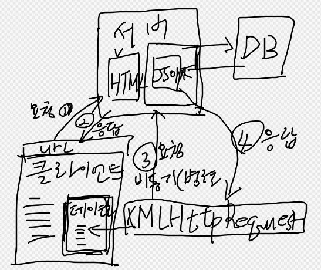

# JS Ajax 개념 - 서버 연동

# Ajax는 비동기 방식의 JS  데이터 전송

[https://www.w3schools.com/js/js_ajax_intro.asp](https://www.w3schools.com/js/js_ajax_intro.asp)

### AJAX는 개발자의 꿈입니다.

- 웹 서버에서 데이터 읽기 - 페이지가 로드된 후
- 페이지를 다시 로드하지 않고 웹 페이지 업데이트
- 웹 서버로 데이터 보내기 - 백그라운드에서



# XMLHttpRequest

### AJAX의 핵심은 XMLHttpRequest 객체

1. XMLHttpRequest 객체를 생성합니다
2. 콜백 함수 정의
3. XMLHttpRequest 객체를 엽니다
4. 서버에 요청 보내기

# 모듈로 분리하기

### 하나의 파일에 작성된 기능들을 모듈로 분리 할 수 있습니다.

- **module.exports 객체에 모듈로 등록 가능.**
- app.js

```jsx
const express = require("express");
const app = express();
const cors = require("cors");

app.set('port', 8888);

// nodejs 모듈에 app을 등록 한다.
**module.exports = app;**
```

- server.js

```jsx
// nodejs에 등록 된 모듈을 불러 온다
**const app = require("./app");**

app.listen(app.get('port'), ()=>{
    console.log(`Server runnig on http://localhost:${app.get('port')}`);
});
```

# Router기능 모듈 분리

- router 디렉토리에 서비스별로 라우터를 분리 한다.
- /router/products.js

```jsx
const express = require('express');
const router = express.Router();

router.route('/products').get((req, res)=>{
    res.end('상품 조회');
}).post((req, res)=>{
    res.end('상품 등록');
});

router.route('/products/:id').get((req, res)=>{
    res.end('특정 상품 조회');
}).post((req, res)=>{
    res.end('특정 상품 수정');
});

// nodejs 모듈로 등록 (app.js에서 미들웨어로 사용)
module.exports = router;
```

- todolist.js

```jsx
const express = require('express');
const router = express.Router();

router.route('/todo').get((req, res)=>{
    res.end('모든 할일 조회');
}).post((req, res)=>{
    res.end('할일 등록');
});

router.route('/todo/:id').get((req, res)=>{
    res.end('특정 할일 조회');
}).post((req, res)=>{
    res.end('특정 할일 수정');
});

// nodejs 모듈로 등록 (app.js에서 미들웨어로 사용)
module.exports = router;
```

- app.js
    - nodejs에 등록된 라우터 모듈들을 불러서 미들웨어로 사용.

```jsx
const express = require("express");
const app = express();
const cors = require("cors");
const productsRouter = require("./router/products");
const todoRouter = require('./router/todolist')

// 한글 처리 필터 미들웨어
// res.send() 사용시 필요 없음.
app.use((req, res, next)=> {
     res.writeHead(200, {'Content-type': 'text/html; charset=UTF-8'});
     next();
});

app.use(productsRouter);
app.use(todoRouter);
module.exports = app;
```

# Controller 모듈로 분리

- app.js
    - dody-parser 미들웨어

```jsx
const express = require("express");
const app = express();
const cors = require("cors");
const productsRouter = require("./router/products");
const todoRouter = require('./router/todolist')

app.use(cors());
app.use(express.json());
app.use(express.urlencoded({extended:false}));
app.set('port', 8888);

// 한글 처리 필터 미들웨어
// res.send() 사용시 필요 없음.
// app.use((req, res, next)=> {
//     res.writeHead(200, {'Content-type': 'text/html; charset=UTF-8'});
//     next();
// });

app.use(productsRouter);
app.use(todoRouter);
module.exports = app;
```

- router/products.js

```jsx
const express = require('express');
const router = express.Router();
const { getAllProducts, getProductById, createProduct, deleteProductById, modifyProductById } 
            = require('../controllers/productsController');

router.route('/products').get(getAllProducts)
                        .post(createProduct);

router.route('/products/:id').get(getProductById)
                    .post(modifyProductById)
                    .delete(deleteProductById);

// nodejs 모듈로 등록 (app.js에서 미들웨어로 사용)
module.exports = router;
```

- productsController.js

```jsx
const ProductDAO = require('../models/productModel');

// 한 페이지에 여러 모듈 등록 가능
module.exports.getAllProducts = (req, res)=>{
    try {
        const products = ProductDAO.findAll();
        //res.send(productList);
        res.status(200).json(products);
    } catch (err) {
        res.status(500).json({"message": "getAllProducts 오류!"});
    }
}

module.exports.getProductById = (req, res)=>{
    const id = req.params.id;
    console.log('>>> 특정 상품 조회 id:', id);
    try {
        const products = ProductDAO.findById(id);
        res.status(200).json(products);
    } catch (err) {
        res.status(500).json({"message": "getProductById 오류!"});
    } 
}

module.exports.createProduct = (req, res)=>{
    const newProduct = {
        name: req.body.name,
        price: req.body.price,
        company: req.body.company,
        year: req.body.year
    }
    console.log(newProduct);
    try {
        ProductDAO.create(newProduct);
        const products = ProductDAO.findAll();
        res.status(200).json(products);
    } catch (err) {
        res.status(500).json({"message": "getProductById 오류!"});
    } 
}

module.exports.modifyProductById = (req, res)=>{
    const id = req.body.id;
    console.log('특정 상품 수정 id: ', id);
    const updateProduct = {
        id: Number(req.body.id),
        name: req.body.name,
        price: Number(req.body.price),
        company: req.body.company,
        year: Number(req.body.year)
    };

    console.log("updateProduct:", updateProduct);

    try {
        ProductDAO.update(Number(id), updateProduct);
        const products = ProductDAO.findAll();
        res.status(200).json(products);
    } catch (err) {
        res.status(500).json({"message": "getProductById 오류!"});
    } 
}

module.exports.deleteProductById = (req, res)=>{
    console.log('>>> 특정 상품 삭제 id:', req.params.id);
    try {
        ProductDAO.delete(req.params.id);
        const products = ProductDAO.findAll();
        res.status(200).json(products);
    } catch (err) {
        res.status(500).json({"message": "getProductById 오류!"});
    } 
}

```

- todoListController.js

```jsx

```

# Models  모듈로 분리

- productModel.js

```jsx

const carList = [
    {id:1, name:'GRANDEUR', price:3000, company:'HYUNDAI', year:2022},
    {id:2, name:'SONATA', price:2000, company:'HYUNDAI', year:2021}
];
let seqId = 103;

//class ProductDao { }
//module.exports = new ProductDao();
// 어차피 한번만 사용하는 객체라면 객체리터럴 사용

const ProductDAO = {
    findAll: ()=>{
        return [...carList];
    },
    findById: (id)=>{
        const idx = carList.findIndex((car)=>{
            return car.id === Number(id);
        });
        console.log("id of dao:", idx);
        if(idx !== -1) {
            return carList[idx];
        }
        return {};
    },
    create: (dto)=>{
        dto.id = seqId++;
        carList.push(dto);
        return [...carList];
    },
    update: (id, dto)=>{
        const idx = carList.findIndex((car)=>{
            // === 연산자는 타입까지 동일 해야 한다.
            return car.id === Number(id);
        });
        if(idx !== -1) {
            carList[idx] = dto;
        }
        return [...carList];
    },
    delete: (id)=>{
        const idx = carList.findIndex((car)=>{
            return car.id === Number(id);
        });
        if(idx !== -1) {
            carList.splice(idx, 1);
        }
        return [...carList];
    }
};

module.exports = ProductDAO;
```

- todoModel.js

```jsx

```

# 실행 테스트

- VS-Code에  Postman 확장기능을 설치하고 각 기능의 결과를 테스트 합니다.


# 클라이언트 프로젝트를 만들어서 Ajax로 연동

### Ajax 기능이용해서 get, post, put, delete기능을 테스트 합니다.

입력, 출력, 검색, 수정, 삭제 기능을 html페이지에서 사용 가능 하도록 합니다. 

client 프로젝트를 만들어서 사용 합니다.

- 서버 쪽 프로젝트 포트: 3035
- 클라이언트 프로젝트 포트: 8085

서버와 클라이언트가 포트가 다를 경우에는 CORS 이슈가 발생합니다.

- cors 미들웨어 모듈을 서버쪽에 설치해서 접속 가능하도록 구현합니다.

## 클라이언트쪽에서 사용 될 nodejs 프로젝트 생성

- public폴더를 serve-static 설정 함.

```jsx
npm i express serve-static

npm i -D nodemon
```

- package.json

```jsx
{
  "name": "proj09client",
  "version": "1.0.0",
  "main": "index.js",
  "scripts": {
    "dev": "server.js",
    "test": "echo \"Error: no test specified\" && exit 1"
  },
  "keywords": [],
  "author": "",
  "license": "ISC",
  "description": "",
  "dependencies": {
    "express": "^4.21.0",
    "serve-static": "^1.16.2"
  },
  "devDependencies": {
    "nodemon": "^3.1.7"
  }
}

```

- app.js

```jsx
const express = require('express');
const app = express();
const serveStatic = require('serve-static');
const path = require('path');

app.set('port', 8085);

app.use('/', serveStatic(path.join(__dirname, 'public')));

module.exports = app;
```

- server.js

```jsx
const http = require('http');
const app = require('./app')

const server = http.createServer(app);
server.listen(app.get('port'), ()=>{
    console.log("서버 실행 중 ... http://localhost:"+ app.get('port'));
});
```


서버와 클라이언트 프로젝트를 동시에 실행 하고 진행 합니다. 


- product-lint.html 목록 기능 구현

```html
<!DOCTYPE html>
<html lang="en">
<head>
    <meta charset="UTF-8">
    <meta name="viewport" content="width=device-width, initial-scale=1.0">
    <title>Document</title>
</head>
<body>
    <h2>중고 자동차 목록</h2>
    <div>
        <p>10년을 타도 새차 같은 느낌!</p>
        <table id="root">
            <thead>
                <tr>
                    <th>ID</th>
                    <th>NAME</th>
                    <th>PRICE</th>
                    <th>COMPANY</th>
                    <th>YEAR</th>
                </tr>
            </thead>
            <tbody id="tbody"></tbody>
        </table>
    </div>

    <script>
        // Ajax를 이용해서 proj09nodeserver로 접속.
        // http://localhost:3035
        // XMLHttpRequest 객체를 이용한 Ajax 접속
        const xhr = new XMLHttpRequest();
        // xhr.onreadystatechange = function() {}
        console.dir(xhr);
        xhr.addEventListener('readystatechange', (e)=>{
            //console.log(">>> 여기가 나중에:", xhr.status, xhr.readyState);
            if(xhr.readyState === 4 && xhr.status === 200) {
                //console.log(xhr.responseText);
                const carList = JSON.parse(xhr.responseText.trim());
                //console.log(carList[0].name);
                let html = "";
                carList.forEach(car => {
                    let trTemp = `<tr>
                        <td>${car.id}</td>
                        <td>${car.name}</td>
                        <td>${car.price}</td>
                        <td>${car.company}</td>
                        <td>${car.year}</td>
                    </tr>`;
                    html += trTemp;
                });
                document.getElementById('tbody').innerHTML = html;
            }
        });

        const method = "GET";
        const url = " http://localhost:3035/products";
        xhr.open(method, url, true);
        xhr.send();
    </script>
</body>
</html>
```

- product-lint.html 에 myAjax 함수 추가

```html
<!DOCTYPE html>
<html lang="en">
<head>
    <meta charset="UTF-8">
    <meta name="viewport" content="width=device-width, initial-scale=1.0">
    <title>Document</title>
</head>
<body>
    <h2>중고 자동차 목록</h2>
    <div>
        <div>
            <ul>
                <li>차종: <input type="text" value="BMW" name="name" / ></li>
                <li>가격: <input type="text" value="3400" name="price" / ></li>
                <li>회사: <input type="text" value="BMW" name="company" / ></li>
                <li>연식: <input type="text" value="2017" name="year" / ></li>
            </ul>
            <button id="saveBtn">저장</button>
        </div>
        <p>10년을 타도 새차 같은 느낌!</p>
        <p><input type="text"><button>검색</button></p>
        <table width="100%" border="1">
            <thead>
                <tr>
                    <th>ID</th>
                    <th>NAME</th>
                    <th>PRICE</th>
                    <th>COMPANY</th>
                    <th>YEAR</th>
                    <th>삭제</th>
                    <th>수정</th>
                </tr>
            </thead>
            <tbody id="tbody"></tbody>
        </table>
    </div>

    <script>
        const myAjax = (method, url, callback) => {
            const xhr = new XMLHttpRequest();
            xhr.addEventListener('readystatechange', (e)=>{
                callback(xhr);
            });
            //const method = "GET";
            //const url = "http://localhost:3035/products";
            xhr.open(method, url, true);
            xhr.send();
        }

        myAjax("GET", "http://localhost:3035/products", (xhr)=>{
            if(xhr.readyState === 4 && xhr.status === 200) {
                const carList = JSON.parse(xhr.responseText.trim());
                let html = "";
                carList.forEach(car => {
                    let trTemp = `<tr>
                        <td>${car.id}</td>
                        <td>${car.name}</td>
                        <td>${car.price}</td>
                        <td>${car.company}</td>
                        <td>${car.year}</td>
                        <td><button>삭제</button></td>
                        <td><button>수정</button></td>
                    </tr>`;
                    html += trTemp;
                });
                document.getElementById('tbody').innerHTML = html;
            }
        });
    </script>
</body>
</html>
```

- 각 버튼의 이벤트 핸들러 추가

```html
<!DOCTYPE html>
<html lang="en">
<head>
    <meta charset="UTF-8">
    <meta name="viewport" content="width=device-width, initial-scale=1.0">
    <title>Document</title>
</head>
<body>
    <h2>중고 자동차 목록</h2>
    <div>
        <div>
            <ul>
                <li>차종: <input type="text" value="BMW" name="name" / ></li>
                <li>가격: <input type="text" value="3400" name="price" / ></li>
                <li>회사: <input type="text" value="BMW" name="company" / ></li>
                <li>연식: <input type="text" value="2017" name="year" / ></li>
            </ul>
            <button id="saveBtn">저장</button>
        </div>
        <p>10년을 타도 새차 같은 느낌!</p>
        <p><input type="text"><button>검색</button></p>
        <table width="100%" border="1">
            <thead>
                <tr>
                    <th>ID</th>
                    <th>NAME</th>
                    <th>PRICE</th>
                    <th>COMPANY</th>
                    <th>YEAR</th>
                    <th>삭제</th>
                    <th>수정</th>
                </tr>
            </thead>
            <tbody id="tbody"></tbody>
        </table>
    </div>

    <script>
        function deleteBtnHandler(btn) {
            console.log(">>> deleteBtnHandler 호출 ...", btn);
        }  

        function editBtnHandler(btn) {
            console.log(">>> editBtnHandler 호출 ...", btn);
        }

        document.getElementById("saveBtn").onclick = function(e) {
            console.log(">>> saveBtnHandler 호출 ...", e.target);
        }
        
        const myAjax = (method, url, callback) => {
            const xhr = new XMLHttpRequest();
            xhr.addEventListener('readystatechange', (e)=>{
                callback(xhr);
            });
            //const method = "GET";
            //const url = "http://localhost:3035/products";
            xhr.open(method, url, true);
            xhr.send();
        }

        myAjax("GET", "http://localhost:3035/products", (xhr)=>{
            if(xhr.readyState === 4 && xhr.status === 200) {
                const carList = JSON.parse(xhr.responseText.trim());
                let html = "";
                carList.forEach(car => {
                    let trTemp = `<tr>
                        <td>${car.id}</td>
                        <td>${car.name}</td>
                        <td>${car.price}</td>
                        <td>${car.company}</td>
                        <td>${car.year}</td>
                        <td><button onclick="deleteBtnHandler(this)">삭제</button></td>
                        <td><button onclick="editBtnHandler(this)">수정</button></td>
                    </tr>`;
                    html += trTemp;
                });
                document.getElementById('tbody').innerHTML = html;
            }
        });
    </script>
</body>
</html>
```

- 저장 기능 구현 saveBtn 이벤트 핸들러

```html
<!DOCTYPE html>
<html lang="en">
<head>
    <meta charset="UTF-8">
    <meta name="viewport" content="width=device-width, initial-scale=1.0">
    <title>Document</title>
</head>
<body>
    <h2>중고 자동차 목록</h2>
    <div>
        <div>
            <form id="inputForm">
                <ul>
                    <li>차종: <input type="text" value="BMW" name="name" / ></li>
                    <li>가격: <input type="text" value="3400" name="price" / ></li>
                    <li>회사: <input type="text" value="BMW" name="company" / ></li>
                    <li>연식: <input type="text" value="2017" name="year" / ></li>
                </ul>
            </form>
            <button id="saveBtn">저장</button>
        </div>
        <p>10년을 타도 새차 같은 느낌!</p>
        <p><input type="text"><button>검색</button></p>
        <table width="100%" border="1">
            <thead>
                <tr>
                    <th>ID</th>
                    <th>NAME</th>
                    <th>PRICE</th>
                    <th>COMPANY</th>
                    <th>YEAR</th>
                    <th>삭제</th>
                    <th>수정</th>
                </tr>
            </thead>
            <tbody id="tbody"></tbody>
        </table>
    </div>

    <script>
        // 자바스크립트 객체를 쿼리스트링으로 변환.
        **function objectToQueryString(obj) {
            const params = new URLSearchParams();
            for (const key in obj) {
                if (obj.hasOwnProperty(key)) {
                    params.append(key, obj[key]);
                }
            }
            return params.toString();
        }**
        
        const myAjax = (method, obj, tarUrl, callback) => {
            const xhr = new XMLHttpRequest();
            xhr.addEventListener('readystatechange', (e)=>{
                callback(xhr);
            });
            xhr.open(method, tarUrl, true);
            if(method.toUpperCase() != "GET") {
                xhr.setRequestHeader("Content-type", "application/x-www-form-urlencoded");
                xhr.send(objectToQueryString(obj));
            } else {
                xhr.send();
            }
        }

        function deleteBtnHandler(btn) {
            console.log(">>> deleteBtnHandler 호출 ...", btn);
        }  

        function editBtnHandler(btn) {
            console.log(">>> editBtnHandler 호출 ...", btn);
        }

        **document.getElementById("saveBtn").onclick = function(e) {
            event.preventDefault();
            const inputForm = document.getElementById("inputForm");
            console.log(">>> saveBtnHandler 호출 ...", e.target);
            const obj = {
                name: inputForm.name.value,
                price: Number(inputForm.price.value),
                company: inputForm.company.value,
                year: Number(inputForm.year.value)
            }
            myAjax("post", obj, "http://localhost:3035/products", (xhr)=>{
                drawList();
            });
        }**

        const drawList = () => {
            myAjax("get", {}, "http://localhost:3035/products", (xhr)=>{
                if(xhr.readyState === 4 && xhr.status === 200) {
                    const carList = JSON.parse(xhr.responseText.trim());
                    let html = "";
                    carList.forEach(car => {
                        let trTemp = `<tr>
                            <td>${car.id}</td>
                            <td>${car.name}</td>
                            <td>${car.price}</td>
                            <td>${car.company}</td>
                            <td>${car.year}</td>
                            <td><button onclick="deleteBtnHandler(this)">삭제</button></td>
                            <td><button onclick="editBtnHandler(this)">수정</button></td>
                        </tr>`;
                        html += trTemp;
                    });
                    document.getElementById('tbody').innerHTML = html;
                }
            });
        }

        drawList();
    </script>
</body>
</html>
```

- 삭제 기능 구현

```html
<!DOCTYPE html>
<html lang="en">
<head>
    <meta charset="UTF-8">
    <meta name="viewport" content="width=device-width, initial-scale=1.0">
    <title>Document</title>
</head>
<body>
    <h2>중고 자동차 목록</h2>
    <div>
        <div>
            <form id="inputForm">
                <ul>
                    <li>차종: <input type="text" value="BMW" name="name" / ></li>
                    <li>가격: <input type="text" value="3400" name="price" / ></li>
                    <li>회사: <input type="text" value="BMW" name="company" / ></li>
                    <li>연식: <input type="text" value="2017" name="year" / ></li>
                </ul>
            </form>
            <button id="saveBtn">저장</button>
        </div>
        <p>10년을 타도 새차 같은 느낌!</p>
        <p><input type="text"><button>검색</button></p>
        <table width="100%" border="1">
            <thead>
                <tr>
                    <th>ID</th>
                    <th>NAME</th>
                    <th>PRICE</th>
                    <th>COMPANY</th>
                    <th>YEAR</th>
                    <th>삭제</th>
                    <th>수정</th>
                </tr>
            </thead>
            <tbody id="tbody"></tbody>
        </table>
    </div>

    <script>
        // 자바스크립트 객체를 쿼리스트링으로 변환.
        function objectToQueryString(obj) {
            const params = new URLSearchParams();
            for (const key in obj) {
                if (obj.hasOwnProperty(key)) {
                    params.append(key, obj[key]);
                }
            }
            return params.toString();
        }
        
        const myAjax = (method, obj, tarUrl, callback) => {
            const xhr = new XMLHttpRequest();
            xhr.addEventListener('readystatechange', (e)=>{
                callback(xhr);
            });
            xhr.open(method, tarUrl, true);
            if(method.toUpperCase() != "GET") {
                xhr.setRequestHeader("Content-type", "application/x-www-form-urlencoded");
                xhr.send(objectToQueryString(obj));
            } else {
                xhr.send();
            }
        }

        **function deleteBtnHandler(btn) {
            console.log(">>> deleteBtnHandler 호출 ...", btn.dataset.id);
            const delId = btn.dataset.id;
            myAjax("delete", {id:delId}, `http://localhost:3035/products/${delId}`, (xhr)=>{
                drawList();
            });
        }**

        function editBtnHandler(btn) {
            console.log(">>> editBtnHandler 호출 ...", btn);
        }

        function editOkHandler(btn) {
            console.log(">>> editOkHandler 호출 ...", btn);
        }

        document.getElementById("saveBtn").onclick = function(e) {
            event.preventDefault();
            const inputForm = document.getElementById("inputForm");
            console.log(">>> saveBtnHandler 호출 ...", e.target);
            const obj = {
                name: inputForm.name.value,
                price: Number(inputForm.price.value),
                company: inputForm.company.value,
                year: Number(inputForm.year.value)
            }
            myAjax("post", obj, "http://localhost:3035/products", (xhr)=>{
                drawList();
            });
        }

        const drawList = () => {
            myAjax("get", {}, "http://localhost:3035/products", (xhr)=>{
                if(xhr.readyState === 4 && xhr.status === 200) {
                    const carList = JSON.parse(xhr.responseText.trim());
                    let html = "";
                    carList.forEach(car => {
                        let trTemp = `<tr>
                            <td>${car.id}</td>
                            <td>${car.name}</td>
                            <td>${car.price}</td>
                            <td>${car.company}</td>
                            <td>${car.year}</td>
                            <td><button data-id="${car.id}" onclick="deleteBtnHandler(this)">삭제</button></td>
                            <td><button onclick="editBtnHandler(this)">수정</button></td>
                        </tr>`;
                        html += trTemp;
                    });
                    document.getElementById('tbody').innerHTML = html;
                }
            });
        }

        drawList();
    </script>
</body>
</html>
```

- 수정 기능 구현
    - 수정 버튼을 누르면 입력 폼에 수정 될 데이터가 담긴다.
    - 수정 버튼은 “Edit”으로 변경 됨.
    - 수정 완료 후 버튼은 다시 “Save”로 변경
    - 참고: carId input에 id값이 저장 되지 않아서 window.carId로 대체 함.(임시)

```html
<!DOCTYPE html>
<html lang="en">
<head>
    <meta charset="UTF-8">
    <meta name="viewport" content="width=device-width, initial-scale=1.0">
    <title>Document</title>
</head>
<body>
    <h2>중고 자동차 목록</h2>
    <div>
        <div>
            <form id="inputForm">
                <input type="text" name="carId" value="">
                <ul>
                    <li>차종: <input type="text" value="BMW" name="name" / ></li>
                    <li>가격: <input type="text" value="3400" name="price" / ></li>
                    <li>회사: <input type="text" value="BMW" name="company" / ></li>
                    <li>연식: <input type="text" value="2017" name="year" / ></li>
                </ul>
            </form>
            <button id="saveBtn">Save</button>
        </div>
        <p>10년을 타도 새차 같은 느낌!</p>
        <p><input type="text"><button>검색</button></p>
        <table width="100%" border="1">
            <thead>
                <tr>
                    <th>ID</th>
                    <th>NAME</th>
                    <th>PRICE</th>
                    <th>COMPANY</th>
                    <th>YEAR</th>
                    <th>삭제</th>
                    <th>수정</th>
                </tr>
            </thead>
            <tbody id="tbody"></tbody>
        </table>
    </div>

    <script>
        // 자바스크립트 객체를 쿼리스트링으로 변환.
        function objectToQueryString(obj) {
            const params = new URLSearchParams();
            for (const key in obj) {
                if (obj.hasOwnProperty(key)) {
                    params.append(key, obj[key]);
                }
            }
            return params.toString();
        }
        
        const myAjax = (method, obj, tarUrl, callback) => {
            const xhr = new XMLHttpRequest();
            xhr.addEventListener('readystatechange', (e)=>{
                callback(xhr);
            });
            xhr.open(method, tarUrl, true);
            if(method.toUpperCase() != "GET") {
                xhr.setRequestHeader("Content-type", "application/x-www-form-urlencoded");
                xhr.send(objectToQueryString(obj));
            } else {
                xhr.send();
            }
        }

        function deleteBtnHandler(btn) {
            console.log(">>> deleteBtnHandler 호출 ...", btn.dataset.id);
            const delId = btn.dataset.id;
            myAjax("delete", {id:delId}, `http://localhost:3035/products/${delId}`, (xhr)=>{
                drawList();
            });
        }  

        **function editBtnHandler(btn) {
            console.log(">>> editBtnHandler 호출 ...", btn);
            const delId = btn.dataset.id;
            myAjax("get", {id:delId}, `http://localhost:3035/products/${delId}`, (xhr)=>{
                const inputForm = document.getElementById("inputForm");
                if(xhr.readyState === 4 && xhr.status === 200) {
                    const car = JSON.parse(xhr.responseText.trim());
                    inputForm.carId.value = car.id;
                    window.carId = car.id;
                    console.log(inputForm.carId.valule);
                    inputForm.name.value = car.name;
                    inputForm.price.value = car.price;
                    inputForm.company.value = car.company;
                    inputForm.year.value = car.year;
                    document.getElementById("saveBtn").innerText = "Edit";
                }
            });
        }**

        document.getElementById("saveBtn").onclick = function(e) {
            event.preventDefault();
            const inputForm = document.getElementById("inputForm");
            console.log(">>> saveBtnHandler 호출 ...", e.target);
            const obj = {
                name: inputForm.name.value,
                price: Number(inputForm.price.value),
                company: inputForm.company.value,
                year: Number(inputForm.year.value)
            }
            **if(e.target.innerText == "Save") {
                myAjax("post", obj, "http://localhost:3035/products", (xhr)=>{
                    if(xhr.readyState === 4 && xhr.status === 200) {
                        drawList();
                    }
                });
            } else {
                //const carId = Number(inputForm.carId.valule);
                const carId = window.carId;
                console.log(carId);
                obj.id = carId;
                myAjax("post", obj, `http://localhost:3035/products/${carId}`, (xhr)=>{
                if(xhr.readyState === 4 && xhr.status === 200) {
                    document.getElementById("saveBtn").innerText = "Save";
                    drawList();
                    inputForm.carId.value = "";
                    inputForm.name.value = "";
                    inputForm.price.value = "";
                    inputForm.company.value = "";
                    inputForm.year.value = "";
                    document.getElementById("saveBtn").innerText = "Save";
                }
            });**
            }
        }

        const drawList = () => {
            myAjax("get", {}, "http://localhost:3035/products", (xhr)=>{
                if(xhr.readyState === 4 && xhr.status === 200) {
                    const carList = JSON.parse(xhr.responseText.trim());
                    let html = "";
                    carList.forEach(car => {
                        let trTemp = `<tr>
                            <td>${car.id}</td>
                            <td>${car.name}</td>
                            <td>${car.price}</td>
                            <td>${car.company}</td>
                            <td>${car.year}</td>
                            <td><button data-id="${car.id}" onclick="deleteBtnHandler(this)">삭제</button></td>
                            <td><button data-id="${car.id}" onclick="editBtnHandler(this)">수정</button></td>
                        </tr>`;
                        html += trTemp;
                    });
                    document.getElementById('tbody').innerHTML = html;
                }
            });
        }

        drawList();
    </script>
</body>
</html>
```