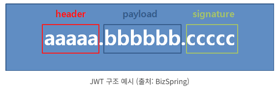

# JWT 로그인

[https://blog.bizspring.co.kr/테크/jwt-json-web-token-구조-사용/](https://blog.bizspring.co.kr/%ED%85%8C%ED%81%AC/jwt-json-web-token-%EA%B5%AC%EC%A1%B0-%EC%82%AC%EC%9A%A9/)



## 1. **서버 코드 (Node.js + Express)**

### **프로젝트 생성 및 필수 라이브러리 설치**

```bash
mkdir jwt-login && cd jwt-login
npm init -y
npm install express jsonwebtoken bcryptjs body-parser cors
```

### **`server.js` – 서버 코드**

```jsx
const express = require('express');
const jwt = require('jsonwebtoken');
const bcrypt = require('bcryptjs');
const bodyParser = require('body-parser');
const cors = require('cors');

const app = express();
const SECRET_KEY = 'your-secret-key'; // 비밀 키

const users = [
  { id: 1, username: 'beomjoon', password: bcrypt.hashSync('pass1234', 8) }
];

app.use(bodyParser.json());
app.use(cors()); // 모든 클라이언트의 요청 허용

// 로그인 엔드포인트
app.post('/login', (req, res) => {
  const { username, password } = req.body;
  const user = users.find((u) => u.username === username);

  if (!user || !bcrypt.compareSync(password, user.password)) {
    return res.status(401).json({ message: 'Invalid credentials' });
  }

  const token = jwt.sign({ userId: user.id }, SECRET_KEY, { expiresIn: '1h' });
  res.json({ token });
});

// 인증 미들웨어
const authenticateJWT = (req, res, next) => {
  const authHeader = req.headers.authorization;
  if (authHeader) {
    const token = authHeader.split(' ')[1];
    jwt.verify(token, SECRET_KEY, (err, user) => {
      if (err) return res.sendStatus(403);
      req.user = user;
      next();
    });
  } else {
    res.sendStatus(401);
  }
};

// 보호된 라우트
app.get('/profile', authenticateJWT, (req, res) => {
  res.json({ message: `Hello user ${req.user.userId}` });
});

const PORT = 3000;
app.listen(PORT, () => {
  console.log(`Server running at http://localhost:${PORT}`);
});
```

---

## 2. **클라이언트 코드 (JavaScript)**

### **HTML 파일 (`index.html`)**

```html
<!DOCTYPE html>
<html lang="en">
<head>
  <meta charset="UTF-8">
  <meta name="viewport" content="width=device-width, initial-scale=1.0">
  <title>JWT Login Example</title>
</head>
<body>
  <h1>JWT Login Example</h1>

  <div>
    <input type="text" id="username" placeholder="Username" />
    <input type="password" id="password" placeholder="Password" />
    <button onclick="login()">Login</button>
  </div>

  <div>
    <button onclick="getProfile()">Get Profile</button>
    <button onclick="logout()">Logout</button>
  </div>

  <script src="client.js"></script>
</body>
</html>
```

### **JavaScript 파일 (`client.js`)**

```jsx
const API_URL = 'http://localhost:3000'; // 서버 URL

// 로그인 함수
async function login() {
  const username = document.getElementById('username').value;
  const password = document.getElementById('password').value;

  const response = await fetch(`${API_URL}/login`, {
    method: 'POST',
    headers: { 'Content-Type': 'application/json' },
    body: JSON.stringify({ username, password }),
  });

  if (response.ok) {
    const { token } = await response.json();
    localStorage.setItem('jwt', token); // JWT 저장
    alert('Login successful!');
  } else {
    alert('Login failed');
  }
}

// 프로필 정보 요청 함수
async function getProfile() {
  const token = localStorage.getItem('jwt'); // 저장된 JWT 가져오기

  const response = await fetch(`${API_URL}/profile`, {
    headers: { Authorization: `Bearer ${token}` },
  });

  if (response.ok) {
    const data = await response.json();
    alert(`Welcome, ${data.message}`);
  } else {
    alert('Authentication failed');
  }
}

// 로그아웃 함수
function logout() {
  localStorage.removeItem('jwt'); // JWT 삭제
  alert('Logged out successfully!');
}
```

---

## 3. **실행 방법**

### **서버 실행**

1. 터미널에서 **서버 폴더**(`jwt-login`)로 이동 후 다음 명령어 실행:
    
    ```bash
    node server.js
    
    ```
    
    - 서버가 `http://localhost:3000`에서 실행됩니다.

### **클라이언트 실행**

1. `index.html` 파일을 브라우저에서 열어 실행합니다.
    - vs-code에서 `Open with live server`로 실행.

### **테스트**

1. **로그인 정보**:
    - **Username**: `beomjoon`
    - **Password**: `password`
2. **로그인 성공** 시:
    - JWT가 `localStorage`에 저장됩니다.
    - 이후 `Get Profile` 버튼을 클릭하면 서버에 저장된 토큰을 사용해 보호된 라우트에 접근합니다.
3. **JWT가 만료되거나 없을 경우**:
    - 인증이 실패하고 에러 메시지가 출력됩니다.

---

## 4. 실행 **결과**

1. **로그인 성공** 시:
    - JWT가 저장되고 서버의 보호된 정보를 볼 수 있습니다.
2. **JWT 사용한 요청**:
    - `Authorization` 헤더에 JWT가 포함됩니다.
3. **JWT 만료 시**:
    - 보호된 정보에 접근할 수 없으며 재로그인이 필요합니다.
4. 로그아웃 버튼을 누르면 localStorage에서 jwt 정보가 삭제 됨.

