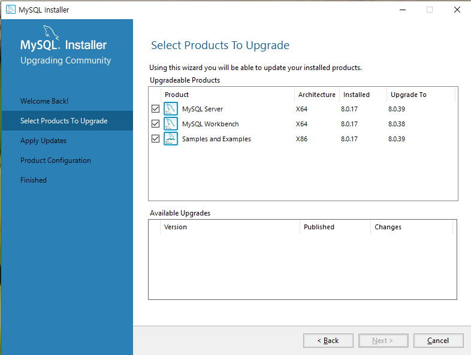

# MySQL 사용하기

# 설치하기

### mysql  서버 다운로드:

[https://dev.mysql.com/get/Downloads/MySQLInstaller/mysql-installer-community-8.0.39.0.msi](https://dev.mysql.com/get/Downloads/MySQLInstaller/mysql-installer-community-8.0.39.0.msi)

### 설치 화면



### MySQL Workbench


# CMD 환경에서 MySQL 접속

- mysql -u계정 -p비밀번호 db

```jsx
~> mysql -uroot -p1234 myapp

mysql> show databases;
```

- 설치 후 cmd에서 mysql 명령어를 실행 할 수 없다면 windows 고급시스템 설정에서 path 등록.
    - 내 PC > 속성 > 고급시스템 설정 > 환경변수 > path 환경 변수에 MySQL 설치 폴더 등록.
    
    
    

### CMD 창을 실행 해서 mysql 서버에 CLI환경으로 접속


# **새로운 계정 생성**

MySQL에서 새로운 계정을 생성하는 명령어는 다음과 같습니다:

```sql
CREATE USER '계정명'@'호스트명' IDENTIFIED BY '비밀번호';
```

```sql
CREATE USER 'comstudy21'@'localhost' IDENTIFIED BY 'comstudy21';
```

- `'comstudy21'`은 새로 생성할 계정의 이름이며, `'localhost'`는 해당 계정이 접속할 수 있는 호스트를 의미함.
- 비밀번호는 `'comstudy21'`로 설정됨.

### **새 계정에 모든 권한 부여**

새 계정에 특정 데이터베이스에 대한 모든 권한을 부여하는 명령어는 다음과 같습니다:

```sql
GRANT ALL PRIVILEGES ON DB명.* TO '계정명'@'호스트명';
```

```sql
GRANT ALL PRIVILEGES ON comstudy21.* TO 'comstudy21'@'localhost';
```

- `comstudy21.*`은 comstudy21 데이터베이스의 모든 테이블에 대한 권한을 의미.
- `'comstudy21'@'localhost'`는 권한을 부여할 사용자 계정임.

### **새 계정으로 접속하기**

생성한 새 계정으로 접속하기 위해서는 다음 명령어를 사용:

```bash
mysql -u계정명 -p비밀번호
```

```bash
mysql -ucomstudy21 -pcomstudy21
```

- `u` 옵션 뒤에 사용자 이름, `p` 옵션 뒤에 비밀번호를 입력하여 접속함.

### **데이터베이스 확인 및 사용**

MySQL에 접속한 후, 사용 가능한 데이터베이스를 확인하고 특정 데이터베이스를 사용하기 위한 명령어는 다음과 같습니다:

```sql
SHOW DATABASES;
USE comstudy21;
SHOW TABLES;
```

- `SHOW DATABASES;`는 MySQL 서버에 존재하는 모든 데이터베이스를 표시.
- `USE comstudy21;` 명령어로 comstudy21 데이터베이스를 선택하여 작업을 수행.
- `SHOW TABLES;`는 현재 데이터베이스에 포함된 모든 테이블을 표시.

## 현재 사용중이 데이터 베이스와 사용자 확인

```sql
SELECT USER();
# 또는
SELECT CURRENT_USER();

# 현재 사용중인 데이터베이스 확인
SELECT DATABASE();
```

# MySQL 명령어 종류

## DDL (Data Definition Language) - 데이터 정의어

대부분 create으로 생성하고 drop으로 제거한다.

### (1) 데이터 베이스 만들기

- 형식: create database DB명;

```sql
# 새 데이터 베이스 생성
create database test1;
# 모든 데이터 베이스 목록 보기
show databases;
```

### (2) 데이터 베이스 삭제

- 형식: drop database DB명;

```sql
# 데이터 베이스 제거
# SQL 명령문은 대,소문자 구분이 없다.
DROP DATABASE test1;
```

### (3) table 생성

- 형식: create table 테이블명(필드명 자료형 옵션, 필드n 자료형 옵션 …);
- 자료형에는 int, varchar, char, tinyint, date, blob …
- null의 의미는 데이터를 넣지 않으면 알 수 없는  데이터가 들어간다. (타입도 없고 내용도 없다.)
- null은 is 연산자로 검색. 타입을 알 수 없기 때문에 == 연산자 사용 불가능.
- 제약 조건이 not null이란, null 을 허용하지 않는다. 비워 둘 수 없다. default 값 적용.
- 날짜는 형식이 ‘2021-10-08’형식으로 문자열처럼 따옴표를 사용 해야 한다. 날짜 검색 시 주의.
- default 입력 값이 없을 때 기본 값으로 사용. 예) 사는 곳, 나이, 성별, 학년 …
- auto_increment: 자동 증가 기능. 주로 primary키에서 사용. (mysql 전용, h2 또는 SQLite에 가능)

```sql
# saram 테이블 생성
create table saram(
	sid int not null primary key auto_increment,
	name varchar(50) not null,
	phone char(20),
	age int,
	gender enum('man', 'woman') not null default('woman')
);
# 테이블 구조 확인
desc saram;
# 해당 db의 모든 테이블 목록
show tables;
```

### (4) table 삭제

- 테이블 삭제: drop table 테이블;
- 삭제 후 재 생성:  truncate table 테이블;
- 내용 삭제: delete from 테이블 where 조건;

```sql
# 테이블 삭제
drop table saram;
# 테이블 목록 
show tables;
```

### (5) table 속성 변경

- 형식: alter table 테이블명 변경명령;
- index 확인 명령: show index from table명

| 명령어 | 설명 |
| --- | --- |
| ALTER TABLE 테이블명 RENAME 새로운 테이블명 | 테이블 이름 변경 |
| ALTER TABLE 테이블명 ADD 필드명 자료형 옵션 | 새로운 필드(열) 추가 |
| ALTER TABLE 테이블명 DROP 필드명 | 필드(열) 삭제 |
| ALTER TABLE 테이블명 CHANGE 필드명 새로운 필드명 옵션 | 필드 이름 변경 및 옵션 수정 |
| ALTER TABLE 테이블명 MODIFY 필드명 자료형 옵션 | 필드의 자료형 및 옵션 변경 |
| ALTER TABLE 테이블명 ADD PRIMARY KEY (필드명) | 기본 키 추가 |
| ALTER TABLE 테이블명 DROP PRIMARY KEY | 기본 키 삭제 |
| ALTER TABLE 테이블명 ADD INDEX (필드명) | 인덱스 추가 |
| ALTER TABLE 테이블명 DROP INDEX (필드명) | 인덱스 삭제 |

```sql
-- 테이블 이름 변경
ALTER TABLE users RENAME TO customers;

-- 새로운 필드(열) 추가
ALTER TABLE users ADD age INT;

-- 필드(열) 삭제
ALTER TABLE users DROP COLUMN age;

-- 필드 이름 변경 및 옵션 수정
ALTER TABLE users CHANGE name full_name VARCHAR(100);

-- 필드의 자료형 및 옵션 변경
ALTER TABLE users MODIFY age SMALLINT;

-- 기본 키 추가
ALTER TABLE users ADD PRIMARY KEY (id);

-- 기본 키 삭제
ALTER TABLE users DROP PRIMARY KEY;

-- 인덱스 추가
ALTER TABLE users ADD INDEX (email);

-- 인덱스 삭제
ALTER TABLE users DROP INDEX email;
```

## DML (Data Manipulation Language) - 데이터 조작어

일반적으로 데이터를 CRUD 하는 명령어 (입력, 출력, 검색, 수정, 삭제)

### (1) 데이터 입력

- 주의: primary key 값이 중복 되면 Error!
- 수정 할 경우 insert 대신 replace

```sql
# 전체 필드에 순서대로 값 입력
insert into 테이블 values(값, 값, ...)
# 특정 필드를 지정해서 값 입력
insert into 테이블(필드, 필드, ...) values (값, 값, ...);
# 여러 레코드의 값을 한꺼번에 입력
insert into 테이블 values (값, 값), (...), ...;
```

- 대량의 대이터를 입력 할 경우 CSV 형식의 파일을 로드해서 사용 가능.
- CSV는 콤마를 이용해서 구분자를 만들고, TSV는 탭을 이용해서 데이터 간의 구분자를 만든다.

```sql

값        값        값        값

값        값        값        값

값        값        값        값

...
```

- MySQL 접속 후 파일 로드 하거너
- CMD 터미널 환경에서 파일을 바로 로드 (DOS 에서 mysql 명령어 직접 실행)
- 형식: mysql --local-infile -u계정 -p비밀번호 데이터베이스
- 데이터를 로드 하거나 할 때는 MySQL Workbench 사용하는 것을 추천
- --local-infile 옵션으로 root 접속

```sql
mysql --local-infile -uroot -p1234 kosta285
```

```sql
SET  GLOBAL local_infile = true;
```

- root 를 exit 후 다시 사용 계정으로 접속

```sql
mysql --local-infile -ucomstudy -pcomstudy kosta285
```

- saram_data.txt 파일 준비 (tsv 형식)

```
11	KIM3	010-1111-1121	13	woman	
12	KIM2	010-1111-1124	13	man	
13	LEE3	010-1111-1123	12	man	
14	PARK3	010-1111-1122	10	woman	
15	KIM33	010-1111-1125	13	man	

```

- 형식: `load data local infile 'C:\\경로명\\파일명' replace into table 테이블명;`

```sql
# 예시
LOAD DATA LOCAL INFILE 'C:\\Users\\beomj\\Documents\\saram_data.txt' 
INTO TABLE kosta285.person 
FIELDS TERMINATED BY '\t' 
LINES TERMINATED BY '\n';
```

### (2) 데이터 검색 (DML에서 별도 분리되어서 그냥 SQL또는 SEQUEL)

- 형식: select * from 테이블
- 특정 필드 검색: select 필드, 필드, 필드n from 테이블 where 조건;
- 조건에는 산술 연산자, 비교 연산자, 논리 연산자 등을 이용해서 조건을 만든다.
- 단 null 데이터를 검색할 때는 =대신 is 사용
- 논리 연산은  and, or, no

```sql
select * from saram;
select * from saram where name = '홍길동';
select * from saram where age >= 18;
```

### (2) 데이터 삭제

- 형식: delete from 테이블 where 조건;

```sql
delete from saram where num=1234;
```

### (3) 데이터 변경

- 형식: update 테이블 set 필드=’값’, 필드=’값’, 필드n=’값’ where 조건;

```sql
update division set postion='deagu', phone='051-123-4567' where dno=30;
update division set postion='deagu', phone='051-123-4567' where dno=30 and bonus=0;
```

# Commit과 Rollback 작업

- **commit**: DML로 변경된 데이터를 데이터베이스에 적용.
- **rollback**: 변경된 데이터를 취소 시킨다. rollback을 하면 직전에 commit이 적용된 시점까지 돌아간다.
- MySQL은 기본 설정이 auto commit 만약 rollback기능을 사용 하려면 auto commit기능을 해제해야 한다.

```sql
# 현재 오토 커밋 상태 확인
SELECT @@autocommit;

# 오토 커밋 상태 변경
SET autocommit = 0;  -- autocommit 비활성화
SET autocommit = 1;  -- autocommit 활성화
```

# Savepoint와 Truncate 작업

- savepoint는 rollback 되는 지점을 지정.

```sql
# 새 savepoint 지점 추가
savepoint aa;
# 여러 DML 사용 후에 rollback하면 지정한 savepoint까지 돌아간다.
rollback aa;
```

- 주의: truncate로 테이블의 데이터를 제거 했을 경우 rollback되지 않는다.

# Select 문 연습

## personal table


- pno : int not null primary key
- pname : varchar(10) not null
- job : varchar(15) not null
- manager : int
- startdate : date
- pay : int
- bonus :int
- dno : int not null

### personal 테이블 생성 쿼리문

```sql
create table personal(
		pno int not null primary key,
		pname varchar(10) not null,
		job varchar(15) not null,
		manager int,
		startdate date,
		pay int,
		bonus int,
		dno int not null
);
```

### personal 테이블 내용 입력

```sql
insert into personal values ( 1111, 'smith', 'manager', 1001, '1990-12-17', 1000, NULL, 10);
insert into personal values ( 1112, 'ally', 'salesman', 1116, '1991-02-20', 1600, 500, 30);
insert into personal values ( 1113, 'word', 'salesman', 1116, '1992-02-24', 1450, 300, 30);
insert into personal values ( 1114, 'james', 'manager', 1001, '1990-04-12', 3975, NULL, 20);
insert into personal values ( 1001, 'bill', 'president', NULL, '1989-01-10', 7000, NULL, 10);
insert into personal values ( 1116, 'johnson', 'manager', 1001, '1991-05-01', 3550, NULL, 30);
insert into personal values ( 1118, 'martin', 'analyst', 1111, '1991-09-09', 3450, NULL, 10);
insert into personal values ( 1121, 'kim', 'clerk', 1114, '1990-12-08', 4000, NULL, 20);
insert into personal values ( 1123, 'lee', 'salesman', 1116, '1991-09-23', 12000, 0, 30);
insert into personal values ( 1226, 'park', 'analyst', 111, '1990-01-03', 2500, NULL, 10);
```

## division 테이블


- dno : int not null primary key
- dname : varchar(15) not null
- phone : varchar(20) not null
- position : varchar(10) not null

### division 테이블 생성 쿼리문

```sql
create table division (
	dno int not null primary key,
	dname varchar(15) not null,
	phone varchar(20) not null,
	position varchar(10) not null
);
```

### division 테이블 내용 입력 쿼리문

```sql
insert into division values (10, 'finance', '032-277-0411', 'inchon');
insert into division values (20, 'reswarch', '061-535-1212', 'busan');
insert into division values (30, 'sales', '02-555-4985', 'seoul');
insert into division values (40, 'marketing', '031-284-3800', 'suwon');
```

## **데이터 조회 및 조건 검색**

### 1. **데이터 가져오기 (SELECT)**

- 모든 데이터를 조회
    
    ```sql
    SELECT * FROM 테이블명;
    ```
    
    ```sql
    SELECT * FROM personal;
    SELECT pno, pname, pay FROM personal;
    SELECT * FROM personal WHERE dno=10;
    ```
    

### 2. **비교 연산자 사용**

- 특정 조건을 만족하는 데이터 조회:
    
    ```sql
    SELECT * FROM personal WHERE dno > 20;
    ```
    

### 3. **논리 연산자 사용 (AND, OR)**

- 다중 조건 검색:
    
    ```sql
    # AND 논리 연산은 두 항이 모두 참일 경우 
    SELECT * FROM personal WHERE dno = 20 AND pno > 1111;
    ```
    

### 4. **IN 연산자 사용**

- 여러 값 중 하나에 해당하는 데이터 조회:
    
    ```sql
    SELECT * FROM personal WHERE dno IN (10, 20);
    ```
    

### 5. **BETWEEN 사용**

- 특정 범위 내의 데이터 검색:
    
    ```sql
    SELECT * FROM personal WHERE dno BETWEEN 20 AND 30;
    ```
    

### 6. **부분 검색 (LIKE)**

- 특정 패턴과 일치하는 데이터 검색:
    
    ```sql
    SELECT * FROM personal WHERE job LIKE 's%';   -- s로 시작하는 단어
    SELECT * FROM personal WHERE job LIKE '%r';   -- r로 끝나는 단어
    ```
    

### 7. **부정 검색 (NOT)**

- 조건을 부정하여 검색:
    
    ```sql
    SELECT * FROM personal WHERE job NOT LIKE 's%';
    ```
    

---

## **데이터 정렬 및 중복 제거**

### 1. **ORDER BY**

- 검색 결과 정렬:
    
    ```sql
    SELECT * FROM personal ORDER BY bonus ASC;    -- 오름차순
    SELECT * FROM personal ORDER BY dno DESC;     -- 내림차순
    ```
    

### 2. **DISTINCT (중복 제거)**

- 중복된 데이터 제거:
    
    ```sql
    SELECT DISTINCT dno FROM personal;
    ```
    

### 3. **별칭 사용 (AS)**

- 결과에 별칭을 사용하여 가독성 향상:
    
    ```sql
    SELECT pname, pay, pay + bonus AS income FROM personal;
    
    ```
    

---

## **수치 연산 및 그룹 함수**

### 1. **수치 연산 및 표현식 사용**

- 값과 수식을 이용한 결과 계산:
    
    ```sql
    SELECT pname, pay, pay + IFNULL(bonus, 0) FROM personal;
    
    ```
    

### 2. **그룹 함수 사용 (SUM, AVG, MIN, MAX, COUNT)**

- 데이터를 그룹별로 집계:
    
    ```sql
    SELECT SUM(pay), AVG(pay), MIN(pay), MAX(pay), COUNT(*) FROM personal;
    
    ```
    

### 3. **GROUP BY와 HAVING**

- 그룹으로 묶어 조건 적용:
    
    ```sql
    SELECT dno, SUM(pay) FROM personal GROUP BY dno HAVING SUM(pay) > 6000;
    
    ```
    

---

## **기타 유용한 함수**

### 1. **문자열 및 날짜 함수**

- 문자열 자르기 및 결합:
    
    ```sql
    SELECT SUBSTR(job, 1, 4) FROM personal;
    SELECT CONCAT(pname, ' job is ', job) FROM personal;
    
    ```
    
- 날짜 함수:
    
    ```sql
    SELECT DAYNAME(startdate) FROM personal;
    SELECT TO_DAYS(NOW()) - TO_DAYS(startdate) FROM personal;
    
    ```
    

### 2. **NULL 값 처리**

- NULL 값을 검색:
    
    ```sql
    SELECT pname FROM personal WHERE bonus IS NULL;
    
    ```
    

### 3. **LIMIT**

- 결과의 개수 제한:
    
    ```sql
    SELECT pname FROM personal LIMIT 5;
    
    ```
    

---

## **연습 문제 예제**

1. 업무가 `clerk`가 아니고 `manager`이 아닌 사원:
    
    ```sql
    SELECT * FROM personal WHERE job NOT IN ('clerk', 'manager');
    
    ```
    
2. 입사일이 1991년 이후이고 급여가 2000 이하인 사원:
    
    ```sql
    SELECT * FROM personal WHERE startdate>='1991-01-01' AND pay<=2000;
    ```
    
3. 업무가 `president`거나 `salesman`인 사원:
    
    ```sql
    SELECT * FROM personal WHERE job IN ('president', 'salesman');
    ```
    
4. 이름의 첫 글자가 a부터 k까지인 사원 이름순 정렬:
    
    ```sql
    SELECT * FROM personal WHERE SUBSTR(pname, 1, 1) >= 'a' AND SUBSTR(pname, 1, 1) <= 'k' ORDER BY pname;
    ```
    

### **논리 함수 사용 예제**

1. 조건에 따라 결과 분기:
    
    ```sql
    SELECT pno, pname, pay, IF(pay >= 1500, 'good', 'poor') AS result FROM personal;
    
    ```
    
2. NULL 값을 대체하여 처리:
    
    ```sql
    SELECT pno, pname, pay, IFNULL(bonus, 100) FROM personal;
    
    ```
    

# 조인과 서브쿼리

- 두 개 이상의 테이블에서 공통 컬럼을 사용하여 데이터를 조회하는 방법을 학습.

## **1. 테이블 조인 (JOIN)**

### 1.1 두 테이블의 곱 (Cartesian Product)

- 모든 조합의 데이터를 출력하는 방법으로, 실무에서는 잘 사용되지 않음.

```sql
SELECT pname, division.dno, dname FROM personal, division;
```

### 1.2 내부 조인 (Inner Join)

- 두 테이블 간의 연결 조건을 만족하는 데이터만 추출.

```sql
SELECT pname, dname, p.dno AS 'p-dno', d.dno AS 'd-dno'
FROM personal p, division d
WHERE p.dno = d.dno;
```

- `JOIN ON` 구문을 이용한 내부 조인:

```sql
SELECT pname, dname, p.dno
FROM personal p
JOIN division d ON p.dno = d.dno;
```

### 1.3 왼쪽 외부 조인 (Left Join)

- 왼쪽 테이블의 모든 데이터와 일치하는 오른쪽 테이블 데이터를 출력. 일치하지 않는 데이터는 `NULL`로 표시.

```sql
SELECT pname, p.dno, pay, dname
FROM personal p
LEFT OUTER JOIN division d ON p.dno = d.dno;

```

### 1.4 오른쪽 외부 조인 (Right Join)

- 오른쪽 테이블의 모든 데이터와 일치하는 왼쪽 테이블 데이터를 출력. 일치하지 않는 데이터는 `NULL`로 표시.

```sql
SELECT pname, p.dno, pay, dname
FROM personal p
RIGHT OUTER JOIN division d ON p.dno = d.dno;
```

### 1.5 셀프 조인 (Self Join)

- 같은 테이블을 서로 다른 이름으로 조인하여 데이터를 조회.

```sql
SELECT p.pno, p.pname as 사원명, p.manager, m.pname as 매니저
FROM personal p
JOIN personal m ON p.manager = m.pno;
```

---

## **2. 서브쿼리 (Sub Query)**

### 2.1 서브쿼리의 개념

- 서브쿼리는 메인 쿼리 내에서 다른 쿼리를 실행하는 형태로, 결과값을 메인 쿼리에 사용함.
- 주로 `WHERE`, `HAVING`, `INSERT`, `DELETE`, `UPDATE` 절에 사용.

### 2.2 서브쿼리 사용 예제

1. **급여가 가장 많은 사람 찾기**:
    
    ```sql
    SELECT pname, pay
    FROM personal
    WHERE pay = (SELECT MAX(pay) FROM personal);
    ```
    
2. **특정 조건에 맞는 데이터 조회**:
    - 사원 번호가 1121인 사람보다 많은 급여를 받는 사람:
    
    ```sql
    SELECT pname
    FROM personal
    WHERE pay > (SELECT pay FROM personal WHERE pno = 1121);
    
    ```
    
3. **부분 집합 조회 (IN, EXISTS)**:
    - 특정 조건에 일치하는 데이터 존재 여부 확인:
    
    ```sql
    SELECT COUNT(*)
    FROM city
    WHERE EXISTS (SELECT * FROM city WHERE CountryCode='KOR');
    
    ```
    

### 2.3 다중행 서브쿼리 (Multi-Row Subquery)

- **ALL, ANY 연산자**를 사용하여 여러 레코드에 대한 조건을 처리.
    - 모든 부서의 평균 급여보다 높은 급여를 받는 사람:
    
    ```sql
    SELECT *
    FROM personal
    WHERE pay > ALL (SELECT AVG(pay) FROM personal GROUP BY dno);
    
    ```
    

### 2.4 서브쿼리의 종류

- **단일행 서브쿼리**: 결과가 하나의 레코드.
- **다중행 서브쿼리**: 결과가 여러 개의 레코드.
- **다중컬럼 서브쿼리**: 결과가 여러 개의 컬럼.

---

## **3. 연습 문제**

1. **급여가 가장 적은 사람**:
    
    ```sql
    SELECT pname, pay
    FROM personal
    WHERE pay = (SELECT MIN(pay) FROM personal);
    
    ```
    
2. **입사일이 가장 빠른 사람**:
    
    ```sql
    SELECT pname
    FROM personal
    WHERE startdate = (SELECT MIN(startdate) FROM personal);
    
    ```
    
3. **평균 급여가 가장 적은 부서의 평균급여보다 급여가 많은 사람**:
    
    ```sql
    SELECT pname
    FROM personal
    WHERE pay > (SELECT AVG(pay) FROM personal WHERE dno = 20);
    
    ```
    

---

# 간단한 댓글 처리 예제

- **MySQL 외래키 지정 예제**
    - 테이블 생성 시 외래키 설정하는 방법:
    
    ```sql
    CREATE TABLE emp (
      emp_no INT(11) UNSIGNED NOT NULL,
      dept_no INT(11) UNSIGNED NOT NULL,
      emp_name VARCHAR(32) NOT NULL,
      PRIMARY KEY (emp_no),
      FOREIGN KEY (dept_no) REFERENCES dept (dept_no)
    ) ENGINE=InnoDB DEFAULT CHARSET=utf8;
    
    ```
    

## 원글을 저장하는 테이블

```sql
create table posts (
id int not null primary key auto_increment,
title varchar(255) not null,
content text
);
```

## 원글에 데이터 입력

```sql
insert into posts (title, content)
values 
('글쓰기 연습1', '글쓰기 연습 내용 1'),
('글쓰기 연습2', '글쓰기 연습 내용 2'),
('글쓰기 연습3', '글쓰기 연습 내용 3');
```

## 댓글을 저장하는 테이블 (원글의 주키를 참조키로 사용)

- `ON DELETE CASCADE`는 참조 무결성을 유지하고, 관련된 데이터를 자동으로 정리.

```sql
create table comments (
cid int not null auto_increment primary key,
post_id int,
comment text,
foreign key(post_id) references posts(id) on delete cascade
);
```

## 댓글의 데이터 입력

```sql
insert into comments (post_id, comment)
values
(1, '글1의 댓글 1'),
(1, '글1의 댓글 2'),
(2, '글2의 댓글 1'),
(2, '글2의 댓글 2'),
(3, '글1의 댓글 1');
```

# 댓글 조회

```sql
select p.id, p.title, c.cid, c.comment from posts p
join comments c on p.id = c.post_id;
```

# **TCL (Transaction Control Language)**

### **데이터베이스 생성과 사용자 연결**

- **TCL**의 의미와 사용 예에 대해 이해하고, 데이터베이스 생성과 사용자 정의 방법을 학습함.

## **1. TCL (Transaction Control Language)**

### **1.1 트랜잭션의 개념과 명령어**

- **트랜잭션(Transaction)**: DML(데이터 조작 언어) 명령을 하나의 처리 단위로 묶어 관리하는 것.
- 트랜잭션 명령어:
    - **COMMIT**: 트랜잭션에서 실행된 변경 사항을 최종적으로 저장.
    - **ROLLBACK**: 트랜잭션 중 오류가 발생하거나 취소할 때 변경 사항을 되돌림.

### **1.2 자동 커밋과 자동 롤백**

- **자동 COMMIT**: 기본적으로 DML 명령어 실행 시 자동으로 적용.
- **자동 ROLLBACK**: SQL 비정상 종료 시 트랜잭션 자동 취소.
- **데이터의 일관성과 무결성**을 유지하기 위해 사용.

---

## **2. MySQL 데이터베이스 생성과 사용자 관리**

### **2.1 데이터베이스 생성**

```sql
CREATE DATABASE comstudy21;  -- comstudy21 데이터베이스 생성

```

### **2.2 사용자 계정 생성**

```sql
CREATE USER 'comstudy21'@'localhost' IDENTIFIED BY 'comstudy21';

```

### **2.3 사용자 권한 부여**

```sql
GRANT ALL PRIVILEGES ON comstudy21.* TO 'comstudy21'@'localhost';

```

### **2.4 새로운 계정으로 접속하기**

```bash
mysql -u comstudy21 -pcomstudy21

```

### **2.5 비밀번호 변경 방법 (MySQL 8.0 이상)**

```sql
ALTER USER 'comstudy21'@'localhost' IDENTIFIED WITH mysql_native_password BY 'com12345';
FLUSH PRIVILEGES;

```

### **2.6 MySQL 사용자 비밀번호 변경 방법**

1. **SET PASSWORD 명령어 사용**
    
    ```sql
    SET PASSWORD FOR '아이디'@'%' = PASSWORD('새로운 비밀번호');
    
    ```
    
2. **UPDATE & FLUSH 사용**
    
    ```sql
    UPDATE mysql.user SET Password = PASSWORD('새로운 비밀번호') WHERE User = '아이디' AND Host = '%';
    FLUSH PRIVILEGES;
    
    ```
    

---

## **3. 데이터 백업과 복구**

### **3.1 테이블 백업 및 복구**

```sql
SELECT * INTO OUTFILE 'backup_file.txt' FROM 테이블명;  -- 테이블 백업
LOAD DATA INFILE 'backup_file.txt' INTO TABLE 테이블명;  -- 테이블 복구

```

### **3.2 데이터베이스 백업 및 복구**

**데이터베이스 백업**: `mysqldump` 명령어 사용

```bash
mysqldump -u 계정명 -p 디비명 > backup_file.sql

```

**데이터베이스 복구**: `mysql` 명령어 사용

```bash
mysql -u 계정명 -p 디비명 < backup_file.sql

```

---

---