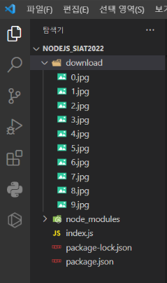

# Nodejs 크롤링

# 새 프로젝트 준비

- 새 노드js 프로젝트 생성



- 필요한 모듈 설치
    - iconv 모듈은 사용 하는  PC에 먼저  Python 설치 되어야 사용 가능 함. (python.org에서 다운로드 후 설치)
    - nodejs 18 버전에서 작동 함. (fnm을 이용해서 하위버전 사용 가능)
        
        ```bash
        # installs fnm (Fast Node Manager)
        winget install Schniz.fnm
        
        # configure fnm environment
        fnm env --use-on-cd | Out-String | Invoke-Expression
        
        # download and install Node.js
        fnm use --install-if-missing 18
        
        # verifies the right Node.js version is in the environment
        node -v # should print `v18.20.4`
        
        # verifies the right npm version is in the environment
        npm -v # should print `10.7.0`
        ```
        
    - fnm 설치 확인 (fnm을   Powershell에서 수동으로 설치하고 Powershell 재실행 후 적용)
        
        ```powershell
        Windows PowerShell
        Copyright (C) Microsoft Corporation. All rights reserved.
        
        새로운 크로스 플랫폼 PowerShell 사용 https://aka.ms/pscore6
        
        PS C:\Users\WD> fnm env --use-on-cd | Out-String | Invoke-Expression
        PS C:\Users\WD> fnm --version
        fnm 1.37.1
        PS C:\Users\WD> fnm use --install-if-missing 18
        Using Node [36mv18.20.4[0m
        PS C:\Users\WD> node -v
        v18.20.4
        PS C:\Users\WD> fnm use --install-if-missing 20
        Installing [36mNode v20.17.0[0m (x64)
        00:00:05 ██████████████████████████████████████████████████████████████████████████ 28.20 MiB/28.20 MiB (5.11 MiB/s, 0s)Using Node v20.17.0
        PS C:\Users\WD> node -v
        v20.17.0
        PS C:\Users\WD> fnm use --install-if-missing 18
        Using Node [36mv18.20.4[0m
        PS C:\Users\WD> node -v
        v18.20.4
        PS C:\Users\WD> npm -v
        10.7.0
        PS C:\Users\WD>
        ```
        
    - 각각 설치 권장
    - windows에서 iconv 설치가 잘 안되면 iconv-lite 설치 권장
        
        ```jsx
        npm i -S axios 
        npm i -S iconv
        # 또는 iconv 대신 iconv-lite 설치
        npm i -S iconv-lite
        npm i -S cheerio
        ```
        
- package.json
    
    ```jsx
    {
      "name": "cheerio-ex",
      "version": "1.0.0",
      "main": "index.js",
      "scripts": {
        "start": "node index.js",
        "dev": "nodemon index.js",
        "test": "echo \"Error: no test specified\" && exit 1"
      },
      "keywords": [],
      "author": "",
      "license": "ISC",
      "description": "",
      "dependencies": {
        "body-parser": "^1.20.3",
        "cors": "^2.8.5",
        "ejs": "^3.1.10",
        "express": "^4.21.0",
        "serve-static": "^1.16.2"
      },
      "devDependencies": {
        "nodemon": "^3.1.7"
      }
    }
    
    ```
    

# 크롤링의 원리

1. 원하는 페이지의 URL을 이용해서 페이지의 모든 텍스트를 가져온다.
2. 텍스트를 HTML DOM으로 변환한다. (iconv가 안되면 → iconv-lite)
3. DOM에서 특정 요소를 Select해서 내용을 저장하거나 JSON구조로 변경한다.

## 네이버 뉴스 > 디지털 타임즈 페이지 크롤링

- 해당 URL은 서버에서 임의로 변경 될 수 있다. (일회성 기술)

### 특정 페이지의 이미지 가져오기

- 특정 페이지의 이미지 url 수집해 오기.

```jsx
const http = require('http');
const express = require('express');
const app = express();
const fs = require('fs');
const path = require('path');

const axios = require('axios');
const cheerio = require('cheerio');
const iconv = require('iconv-lite');

app.set('port', 3333);

app.get('/axios', (req, res)=>{
    const getUrlVal = "https://media.naver.com/press/029";
    axios.get(getUrlVal, {responseType:"arraybuffer"}).then((response)=>{
        let htmlCMD = iconv.decode(response.data, "UTF-8").toString();
        let $ = cheerio.load(htmlCMD);

        let selectData = $('ul.press_edit_news_list img');
        console.log(selectData.length);
        for(var i=0; i<10; i++) {
            let imgUrl = selectData[i].attribs['data-src']
            console.log(imgUrl);
        }

        res.end("");
    });
});

const server = http.createServer(app);
server.listen(app.get('port'), ()=>{
    console.log(`Run on Server >>> http://localhost:${app.get('port')}`);
});
```

## 코스타 웹 사이트 이미지 크롤링

- 프로젝트 디렉토리 구조


- app.js 소스코드

```jsx
const http = require('http');
const express = require('express');
const app = express();
const fs = require('fs');
const path = require('path');

const axios = require('axios');
const cheerio = require('cheerio');
const iconv = require('iconv-lite');

app.set('port', 3333);

app.get('/axios', (req, res)=>{
    const getUrlVal = "https://www.kosta.or.kr/about";
    axios.get(getUrlVal, {responseType:"arraybuffer"}).then((response)=>{
        let htmlCMD = iconv.decode(response.data, "UTF-8").toString();
        let $ = cheerio.load(htmlCMD);

        let selectData = $('div._img_box img');
        var cnt = 0;
        console.log(selectData);
        for(var i=0; i<selectData.length; i++) {
            let imgUrl = selectData[i].attribs.src
            let imgDataUrl = imgUrl.split('?')[0];
            axios.get(imgDataUrl, {responseType:"arraybuffer"}).then((imgres)=>{
                console.log(imgres.data);
                fs.writeFile(`./download/${cnt++}.jpg`, imgres.data, ()=>{
                    console.log("이미지 다운로드 완료!");
                });
            });
        }

        res.end("");
    });
});

const server = http.createServer(app);
server.listen(app.get('port'), ()=>{
    console.log(`Run on Server >>> http://localhost:${app.get('port')}`);
});
```