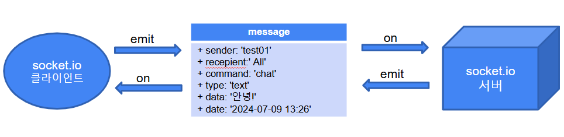

# Socket.io 기초

# **웹 소켓의 특징**

- **실시간성**: 데이터 전송 지연이 적어 실시간 통신에 적합합니다.
- 양방향 통신: 클라이언트와 서버 간에 양방향으로 데이터를 주고받을 수 있습니다.
- 지속적인 연결: 연결을 설정한 후 계속해서 데이터를 주고받을 수 있어 커넥션 오버헤드가 적습니다.

# Socket.io 활용 영역?

- Socket은 전화 소켓?
- 웹은 단방향, 소켓은 양방향 통신이 가능하다.
- 파이널 프로젝트에서 뭔가 좀 있어 보이는 기능 구현을 가능하게 한다.
- 챗팅 기능. 그룹 채팅 기능이 기본 포함 되었다. 화상 채팅 기능도 구현 가능.
- 전자칠판 (자바스크립트 Canvas, 2D, 3D 가능).
- 온라인 게임 형태의 기능 구현.
- 실시간 통신 …

# 소켓io 모듈 설치

### 공식 사이트 참조

- [https://socket.io/](https://socket.io/)

### 소켓io 모듈 설치

```bash
# Node.js 프로젝트 생성
	npm init -y
# socket.io 모듈 설치
  npm install socket.io --save
# express 및 cors 모듈 설치
  npm install express cors --save
```

## 서버 구성

```jsx
var http=require('http');
var express=require('express');
var app = express()
var cors=require('cors');
var static = require('serve-static');
var path = require('path');

var socketio=require('socket.io');

const PORT = 3000;
app.use( cors() );

// 미들웨어 및 뷰엔진 설정 ...

// app 패스

// server 및 socket 서버 구현
var app = express();
// … 중간 생략 …
var server = http.createServer(app).listen(PORT, function() {
    console.log('서버가 시작되었습니다. http://127.0.0.1:' + PORT);
});

var io = socketio(server);
io.sockets.on('connection', function(socket){
    console.log('클라이언트 소켓 접속 성공!');
    console.log('connection info: ', socket.request);
});
```

## 서버와 클라이언트 간의 이벤트 연결

- emit으로 이벤트를 발생 시킨다.
- on을 이용해서 이벤트를 감지한다.



## 클라이언트 구성

- 포트가 다른 크라이언트 가능.
- 클라이언트에서는 CDN을 이용해서 소켓 사용
- 외부  CDN을 사용 할 수도 있고 Node.js 소켓서버에서 제공 되는 cdn을 사용 가능.

```html
<script src="https://cdn.socket.io/4.5.4/socket.io.min.js"></script>
<script>
    var socket = io().connect('http://localhost:3000');
    socket.on(`connect`, function(data) {
        console.log(`서버 접속 성공!`);
    });
</script>
```

## nodemon 모듈 사용

- package.json에 스크립트 추가

```json
{
  "name": "proj18socketio",
  "version": "1.0.0",
  "main": "index.js",
  "scripts": {
    "dev": "nodemon server.js",
    "start": "node server.js",
    "test": "echo \"Error: no test specified\" && exit 1"
  },
  "keywords": [],
  "author": "",
  "license": "ISC",
  "description": "",
  "dependencies": {
    "cors": "^2.8.5",
    "express": "^4.21.1",
    "socket.io": "^4.8.0"
  },
  "devDependencies": {
    "nodemon": "^3.1.7"
  }
}
```

- 실행

```json
npm run dev
```

# 서버 - 클라이언트 메아리 기능 구현

- server.js
    - 포트가 다를 경우 Cross-origin 이슈가 발생한다. cors 모듈을 이용해서 설정.

```json
const http = require('http');
const express = require('express');
const app = express();
const cors = require('cors');
const path = require('path');
const socketio = require('socket.io');

app.set('port', 3000);

app.use(express.static(path.join(__dirname, "public")))

app.use(cors());
//app.use(cors({origin: 'http://127.0.0.1:5500'}));

const server = http.createServer(app);
server.listen(app.get('port'), () => {
    console.log(`서버 실행 중 >>> http://localhost:${app.get('port')}`);
});

// socket.io와 server가 같은 포트를 사용
const io = socketio(server, {
    cors: {
      // origin: 'http://127.0.0.1:5500', // 클라이언트 도메인 허용, 생략은 모두 허용
      methods: ['GET', 'POST'], // 허용할 메서드 명시
    },
});

// io.sockets.on('connection', (socket)=>{});
io.on('connection', (socket)=>{
    console.log('>>> 클라이언트가 접속 :');
    
    //  1대1 통신 socket.on()
    socket.on('message', (data) => {
        // 모든 접속 소켓에 전달
        console.log('클라이언트가 보낸 메세지: ', data);
        io.sockets.emit('message', '전체에게 보냄-> ' + data);
        socket.emit('message', '한 곳에 보낸 메세지: Hello world!');
    });
});
```

- public/index.html

```json
<!DOCTYPE html>
<html lang="en">
<head>
    <meta charset="UTF-8">
    <meta name="viewport" content="width=device-width, initial-scale=1.0">
    <title>Document</title>
</head>
<body>

    <h1>Node.js 소켓 io 실습</h1>

    <script src="https://cdn.socket.io/4.5.4/socket.io.min.js"></script>
    <script>
        // io.connect('http://127.0.0.1:3000');
      const socket = io('http://127.0.0.1:3000');  // 서버 포트에 맞게 수정
      // 연결 성공하면 서버에서 메세지 받기
      socket.on('connect', (data) => {
        console.log('>>> 서버 연결 성공:', data);

        socket.emit('message', '클라이언트에서 보낸 메세지');

        socket.on('message', (msg)=>{
            console.log('서버 메세지 확인:', msg);
        });
      });
    </script>
    
</body>
</html>
```


# socket.io 라이브러리의 특징

1. 실시간 이벤트 기반 통신
2. 룸(Room) 기능
3. 네임스페이스 기능
4. 자동 재연결이 된다
5. 폴링 및 웹 소켓 지원
6. 브라우저 뿐 아니라 다양한 세션과 플렛폼에서 지원

## 접속하고 메세지 주고 받기


- server.js

```jsx
const http = require('http');
const express = require('express');
const app = express();
const cors = require('cors');
const path = require('path');
const socketio = require('socket.io');

app.set('port', 3000);

app.use(express.static(path.join(__dirname, "public")))

app.use(cors());
//app.use(cors({origin: 'http://127.0.0.1:5500'}));

const server = http.createServer(app);
server.listen(app.get('port'), () => {
    console.log(`서버 실행 중 >>> http://localhost:${app.get('port')}`);
});

// socket.io와 server가 같은 포트를 사용
const io = socketio(server, {
    cors: {
      // origin: 'http://127.0.0.1:5500', // 클라이언트 도메인 허용, 생략은 모두 허용
      methods: ['GET', 'POST'], // 허용할 메서드 명시
    },
});

// io.sockets.on('connection', (socket)=>{});
io.on('connection', (socket)=>{
    console.log('>>> 클라이언트가 접속 :');
    
    //  1대1 통신 socket.on()
    socket.on('message', (data) => {
        // 모든 접속 소켓에 전달
        console.log('클라이언트가 보낸 메세지: ', data);
        io.sockets.emit('message', '전체에게 보냄-> ' + data);
        socket.emit('message', '한 곳에 보낸 메세지: Hello world!');
    });
});
```

- public/index.html

```html
<!DOCTYPE html>
<html lang="en">
<head>
    <meta charset="UTF-8">
    <meta name="viewport" content="width=device-width, initial-scale=1.0">
    <title>Document</title>
</head>
<body>

    <h1>Node.js 소켓 io 실습</h1>
    <div>
        1. 유알엘: <input type="text" id="connectUrl" value="http://127.0.0.1:3000">
        <button id="connectBtn">접속</button>
    </div>
    <div>
        2. 메세지: <input type="text" id="messageInput" value="Hello world">
        <button id="sendBtn">전송</button>
    </div>
    <div>
        3. 결과: 
        <div id="resultBox"></div>
    </div>

    <!-- 
    참고: jQuery 의 특징
    1. DOM 셀렉터 쉽게
    2. Ajax를 쉽게
    3. 애니메이션 효과
    -->
    <script>
        // document.querySelecot('#connectBtn'); 대신 다음 jQuery 사용.
        // $('#connectBtn').click((event)=>{
        //     alert("버튼 클릭!");
        // });
    </script>
    
    <script src="http://code.jquery.com/jquery.js"></script>
    <script src="https://cdn.socket.io/4.5.4/socket.io.min.js"></script>
    <script>

        let socket = null;

        const connectBtn = document.querySelector('#connectBtn');
   
			  // 버튼이 눌러지면 연결 됨.
        connectBtn.onclick = function() {
            socket = io('http://127.0.0.1:3000');  // 서버 포트에 맞게 수정

            if(socket) {
                // 연결 성공하면 서버에서 메세지 받기
                socket.on('connect', () => {
                    console.log('>>> 서버 연결 성공:');
                    socket.on('message', (msg)=>{
                        console.log('서버 메세지 확인:', msg);
                    });
                });
            }
        }
    </script>
    
</body>
</html>
```