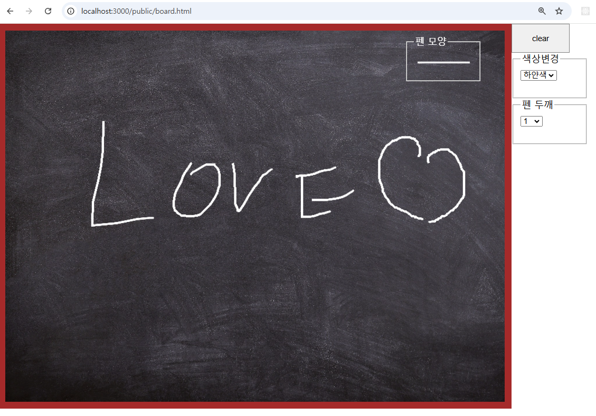

# Socket.io와 Canvas로 전자칠판 구현



### 깃허브 소스코드:

[https://github.com/comstudyschool/kosta202409/tree/main/_NodeJS_Canvas_JS](https://github.com/comstudyschool/kosta202409/tree/main/_NodeJS_Canvas_JS)

# **온라인 전자 칠판 구현**

이 예제에서는 **Node.js와 [Socket.io](http://socket.io/)**를 사용하여 여러 클라이언트가 동일한 화면에 **실시간으로 그림을 그릴 수 있는 전자 칠판**을 구현합니다. 클라이언트가 마우스를 사용해 그림을 그리면 **소켓을 통해 데이터를 전송**하고, 모든 클라이언트가 그 정보를 받아 동일한 그림을 표시하게 됩니다.

---

## **1. 동작 원리**

1. **클라이언트에서 그리기 동작 감지**:
    - 마우스 이벤트(`mousedown`, `mousemove`, `mouseup`)를 통해 **그리기 동작**을 감지합니다.
2. **서버와 실시간 데이터 전송**:
    - 그림의 좌표와 색상 정보가 [**Socket.io**](http://socket.io/)를 통해 서버에 전송됩니다.
    - 서버는 해당 정보를 다른 모든 클라이언트에 **브로드캐스트**합니다.
3. **모든 클라이언트에서 동일한 그림 표시**:
    - 서버로부터 받은 그리기 데이터를 각 클라이언트에서 처리하여 동일한 그림을 표시합니다.

---

## **2. 소스 코드 분석**

### **서버 코드: `app.js`**

- **역할**: 서버는 [**Socket.io**](http://socket.io/)를 사용해 클라이언트로부터 데이터를 받아 다른 클라이언트에 **브로드캐스트**합니다.
- **핵심 기능**:
    1. 클라이언트 연결 시 콘솔에 로그를 출력합니다.
    2. `linesend` 이벤트로 클라이언트의 그리기 데이터를 받고, 이를 다른 클라이언트로 전송합니다.

```jsx
var http = require('http');
var express = require('express');
var app = express();
var server = http.createServer(app);
var socketio = require('socket.io');
var path = require('path');

// 서버 설정
app.set('port', process.env.PORT || 3000);
app.use('/public', express.static(path.join(__dirname, '/public')));

// 서버 시작
server.listen(app.get('port'), function () {
    console.log('서버가 실행 >>> <http://localhost:3000/public/board.html>', app.get('port'));
});

// Socket.io 초기화
var io = socketio.listen(server);

// 소켓 연결 처리
io.sockets.on('connection', function (socket) {
    console.log('소켓 연결됨:', socket.request.connection._peername);

    // 클라이언트로부터 그리기 데이터를 수신
    socket.on('linesend', function(data) {
        console.log(data);
        socket.broadcast.emit('linesend_tocllinet', data); // 다른 클라이언트에 브로드캐스트
    });

    // 연결 종료 시 로그 출력
    socket.on('disconnect', function() {
        console.log('user disconnected');
    });
});

```

---

### **클라이언트 코드: `board.html`**

- **역할**: HTML 페이지에서 **Canvas**를 사용해 그림을 그리고, 그림 데이터를 서버에 전송합니다.
- **주요 기능**:
    1. **캔버스 설정**: 사용자가 그림을 그릴 수 있도록 캔버스를 설정합니다.
    2. **마우스 이벤트 처리**: 그림의 시작(`mousedown`), 움직임(`mousemove`), 종료(`mouseup`)을 감지합니다.
    3. **Socket.io와의 통신**: 그리기 데이터를 서버로 전송하고, 서버로부터 받은 데이터를 표시합니다.

```html
<!DOCTYPE html>
<html lang="en">
<head>
    <meta charset="UTF-8">
    <title>전자 칠판</title>
    <script src="js/jquery.js"></script>
    <script src="js/underscore.js"></script>
    <script src="js/board.js"></script>
    <script src="js/socket.io.js"></script>
    <link rel="stylesheet" type="text/css" href="css/style.css">
</head>
<body>
    <canvas id="cv"></canvas>

    <div id="menu">
        <button id="clear">clear</button>
        <fieldset>
            <legend>색상 변경</legend>
            <select id="pen_color"></select>
        </fieldset>
        <fieldset>
            <legend>펜 두께</legend>
            <select id="pen_width"></select>
        </fieldset>
    </div>
</body>
</html>

```

---

### **JavaScript 코드: `js/board.js`**

- **역할**: 클라이언트에서 그림을 그리는 동작을 감지하고, 그 데이터를 서버에 전송합니다.
- **핵심 기능**:
    1. **Canvas 초기화 및 그리기 동작 처리**: 사용자가 마우스를 움직일 때마다 좌표를 기록합니다.
    2. **Socket.io를 사용한 데이터 전송 및 수신**: 그리기 데이터를 서버로 보내고, 서버로부터 데이터를 받아 그림을 표시합니다.

```jsx
let ctx;
let socket;

// 펜 색상과 두께 설정
const shape = {
    color: 'white',
    width: 3,
    change: function() {
        const color = document.querySelector('#pen_color').value;
        const width = document.querySelector('#pen_width').value;
        this.setShape(color, width);
    },
    setShape: function(color, width) {
        if (color) this.color = color;
        if (width) this.width = width;
        ctx.strokeStyle = this.color;
        ctx.lineWidth = this.width;
    }
};

// 메시지 전송 객체
const msg = {
    line: {
        send: function(type, x, y) {
            socket.emit('linesend', { type, x, y, color: shape.color, width: shape.width });
        }
    }
};

// 그리기 동작 처리 객체
const draw = {
    drawing: false,
    start: function(e) {
        ctx.beginPath();
        ctx.moveTo(e.pageX, e.pageY);
        this.drawing = true;
        msg.line.send('start', e.pageX, e.pageY);
    },
    move: function(e) {
        if (this.drawing) {
            ctx.lineTo(e.pageX, e.pageY);
            ctx.stroke();
            msg.line.send('move', e.pageX, e.pageY);
        }
    },
    end: function() {
        this.drawing = false;
        msg.line.send('end');
    },
    clear: function() {
        ctx.clearRect(0, 0, cv.width, cv.height);
        msg.line.send('clear');
    },
    drawfromServer: function(data) {
        if (data.type === 'start') {
            ctx.beginPath();
            ctx.moveTo(data.x, data.y);
            ctx.strokeStyle = data.color;
            ctx.lineWidth = data.width;
        } else if (data.type === 'move') {
            ctx.lineTo(data.x, data.y);
            ctx.stroke();
        } else if (data.type === 'clear') {
            ctx.clearRect(0, 0, cv.width, cv.height);
        }
    }
};

// 문서가 로드되면 실행
document.addEventListener('DOMContentLoaded', () => {
    const canvas = document.querySelector('#cv');
    ctx = canvas.getContext('2d');
    canvas.width = 860;
    canvas.height = 640;

    canvas.addEventListener('mousedown', draw.start.bind(draw));
    canvas.addEventListener('mousemove', draw.move.bind(draw));
    canvas.addEventListener('mouseup', draw.end.bind(draw));

    document.querySelector('#clear').addEventListener('click', draw.clear.bind(draw));

    socket = io.connect(`http://${window.location.host}`);
    socket.on('linesend_tocllinet', (data) => {
        draw.drawfromServer(data);
    });
});
```

---

## **3. 실행 방법**

1. **서버 실행**:
    
    ```bash
    node app.js
    ```
    
2. **브라우저에서 열기**:
    - `http://localhost:3000/public/board.html`에 접속합니다.
3. **테스트**:
    - 여러 브라우저 탭을 열고 그림을 그리면 다른 탭에서도 동일한 그림이 표시됩니다.