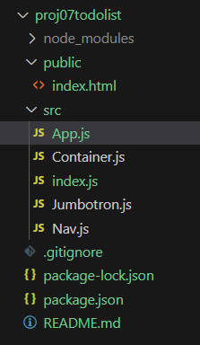

# React TodoList 구현

# 새 프로젝트 생성

- 새 프로젝트를 생성 하고 새로운 작업 환경 구성

```bash
create-react-app
```

- App.css

```css
.App-header {
  background-color: #282c34;
  min-height: 100vh;
  display: flex;
  flex-direction: column;
  align-items: center;
  justify-content: center;
  font-size: calc(10px + 2vmin);
  color: white;
}
```

# 부트스트랩 CND 방식으로  React에 적용 해 보기

- index.html에 부트스트랩 CDN을 붙여서 사용 가능.
- 주의 할 점  class속성을  className으로 변경
- style속은 객체 리터럴 사용. style={{color:”red”}}



- 콤포넌트로 변경 할 부트스랩 템플릿
    - [https://www.w3schools.com/bootstrap4/tryit.asp?filename=trybs_template1](https://www.w3schools.com/bootstrap4/tryit.asp?filename=trybs_template1)

```css
<!DOCTYPE html>
<html lang="en">
<head>
  <title>Bootstrap 4 Website Example</title>
  <meta charset="utf-8">
  <meta name="viewport" content="width=device-width, initial-scale=1">
  <link rel="stylesheet" href="https://cdn.jsdelivr.net/npm/bootstrap@4.6.2/dist/css/bootstrap.min.css">
  <script src="https://cdn.jsdelivr.net/npm/jquery@3.7.1/dist/jquery.slim.min.js"></script>
  <script src="https://cdn.jsdelivr.net/npm/popper.js@1.16.1/dist/umd/popper.min.js"></script>
  <script src="https://cdn.jsdelivr.net/npm/bootstrap@4.6.2/dist/js/bootstrap.bundle.min.js"></script>
  <style>
  .fakeimg {
    height: 200px;
    background: #aaa;
  }
  </style>
</head>
<body>

<div class="jumbotron text-center" style="margin-bottom:0">
  <h1>My First Bootstrap 4 Page</h1>
  <p>Resize this responsive page to see the effect!</p> 
</div>

<nav class="navbar navbar-expand-sm bg-dark navbar-dark">
  <a class="navbar-brand" href="#">Navbar</a>
  <button class="navbar-toggler" type="button" data-toggle="collapse" data-target="#collapsibleNavbar">
    <span class="navbar-toggler-icon"></span>
  </button>
  <div class="collapse navbar-collapse" id="collapsibleNavbar">
    <ul class="navbar-nav">
      <li class="nav-item">
        <a class="nav-link" href="#">Link</a>
      </li>
      <li class="nav-item">
        <a class="nav-link" href="#">Link</a>
      </li>
      <li class="nav-item">
        <a class="nav-link" href="#">Link</a>
      </li>    
    </ul>
  </div>  
</nav>

<div class="container" style="margin-top:30px">
  <h1>Hello world</h1>
</div>

<div class="jumbotron text-center" style="margin-bottom:0">
  <p>Footer</p>
</div>

</body>
</html>

```

## 콤포넌트로 변경

- index.js
    
    ```jsx
    import React from "react";
    import ReactDOM from "react-dom/client"
    import App from "./App";
    
    const container = document.getElementById("root");
    const root = ReactDOM.createRoot(container);
    root.render(<App />);
    ```
    
- App.js
    
    ```jsx
    import Container from "./Container";
    import Jumbotron from "./Jumbotron";
    import Nav from "./Nav";
    
    const App = () => {
        return (<>
            <Jumbotron />
            <Nav />
            <Container />
        </>);
    }
    
    export default App;
    ```
    
- Jumbotron.js
    
    ```jsx
    const Jumbotron = () => {
        return (<div className="jumbotron text-center" style={{marginBottom:0}}>
            <h1>My First Bootstrap 4 Page</h1>
            <p>Resize this responsive page to see the effect!</p> 
        </div>);
    }
    
    export default Jumbotron;
    ```
    
- Nav.js
    
    ```jsx
    const Nav = () => {
        return (<nav className="navbar navbar-expand-sm bg-dark navbar-dark">
            <a className="navbar-brand" href="#">Navbar</a>
            <button className="navbar-toggler" type="button" data-toggle="collapse" data-target="#collapsibleNavbar">
              <span className="navbar-toggler-icon"></span>
            </button>
            <div className="collapse navbar-collapse" id="collapsibleNavbar">
              <ul className="navbar-nav">
                <li className="nav-item">
                  <a className="nav-link" href="#">Link</a>
                </li>
                <li className="nav-item">
                  <a className="nav-link" href="#">Link</a>
                </li>
                <li className="nav-item">
                  <a className="nav-link" href="#">Link</a>
                </li>    
              </ul>
            </div>  
        </nav>);
    }
    
    export default Nav;
    ```
    
- Continer.js
    
    ```jsx
    const Container = () => {
        return (<div className="container" style={{marginTop:"30px"}} >
            <h3>할일 입력</h3>
            <ul>
                <li>학교가기</li>
                <li>밥먹기</li>
                <li>놀기</li>
            </ul>
        </div>);
    }
    
    export default Container;
    ```
    


참고:  React에서 필요한 필수 ES6 문법 : [https://www.w3schools.com/react/react_es6.asp](https://www.w3schools.com/react/react_es6.asp)

# Todo 입력 및 목록 구현

- 같은 콤포넌트에 구현 후 분리
- input 기능을 먼저 구현 (이벤트 핸들러를 이용해서 state와 동기화 되도록 구현)

```jsx
import { useState } from "react";

const Container = () => {
    const [newTodo, setNewTodo] = useState("");

    return (<div className="container" style={{marginTop:"30px"}} >
        <p>
            <input type="text" value={newTodo} onChange={(e)=>{
                // state를 변경하면 변경된 내용이 input에 반영
                // state는 setter를 이용해서 변경
                setNewTodo(e.target.value);
                console.log(newTodo);
            }} />
            <button>SAVE</button>
            {newTodo}
        </p>
    </div>);
}

export default Container;
```

# 배열 state의 요소 변경

- state 배열을 복제한다. (Spreed 연산자 사용 또는 반문문이나 생성자 사용)
    - [https://www.w3schools.com/react/react_es6_spread.asp](https://www.w3schools.com/react/react_es6_spread.asp)
- 복제 된 새 별에 요소를 변경
- 새 배열을 state에 적용 (리렌더링 된다)

```jsx
import { useState } from "react";

const Container = () => {
    const [newTodo, setNewTodo] = useState("");

    let listArray = [
        <li>학교가기</li>,
        <li>밥먹기</li>,
        <li>놀기</li>
    ];
    const [todoList, setTodoList] = useState(listArray);

    const inputHandler = (e) => {
        setNewTodo(e.target.value);
    }

    const buttonHandler = (e) => {
        // 버튼 핸들러에서 state 사용
        console.log(newTodo);
        // todoList 내용 복제 (생성자, 반복문, 스프리드 연산자)
        // 복제된 todoList에 새 요소 추가
        // 복제된 todoList를 setTodoLit 한다. (리렌더링 됨)

        //let newTodoList = [...todoList]; 
        //newTodoList.push(<li>{newTodo}</li>);

        //let newTodoList = [...todoList, <li>{newTodo}</li>]
        //setTodoList(newTodoList);

        setTodoList([...todoList, <li>{newTodo}</li>]);
    }

    return (<div className="container" style={{marginTop:"30px"}} >
        <h3>할일 입력</h3>
        <p>
            <input type="text" value={newTodo} onChange={inputHandler} />
            <button onClick={buttonHandler}>SAVE</button>
            {newTodo}
        </p>
        <hr />
        <h3>할일 목록</h3>
        <ul>
            {todoList}
        </ul>
    </div>);
}

export default Container;
```

### todoList 내용 요소 구조 변경

- todoList 내용을 객체 리터럴 형태로 변경한다.

```jsx
let listArray = [
    {_id:"todo0001", title:"밥먹고 커피 마시기", done: false},
    {_id:"todo0002", title:"TodoList 과제하기", done: true},
    {_id:"todo0003", title:"미니 프로젝트 기획", done: false},
    {_id:"todo0004", title:"파이널 프로젝트 팀회의", done: false}
];
const [todoList, setTodoList] = useState(listArray);
const [todoId, setTodoId] = useState(5);
```

### 변경된 구조에 새 데이터 저장

- spreed 연산자를 이용해서 state Array를 복제.
- 내용 변경 후 다시 setTodoList하면 콤포넌트가 리랜더링 된다.

```jsx
const buttonHandler = (e) => {
    setTodoList([...todoList, {_id:"todo000"+todoId, title:newTodo, done: false}]);
    setTodoId(todoId+1);
    // 배열에 추가 후 state 초기화
    setNewTodo("");
}
```

### li 태그 리스트를 만들어 주는 메서드

- for문이나 forEach메서드를 이용
- .map 메서드를 이용하는 것이 가장 간략하다.

```jsx
function makeLi() {
    // let todoListLi = [];
    // 처리
    // for(var i=0; i<todoList.length; i++) {
    //     todoListLi.push(<li key={i}>{todoList[i].title}</li>);
    // }

    // todoList.forEach((todo, i)=>{
    //     todoListLi.push(<li key={i}>{todoList[i].title}</li>);
    // });
    // return todoListLi;

    return todoList.map((todo, i) => {
        return <li key={i}>{todoList[i].title}</li>
    });
}
```

### 함수를 새로 만들 필요 없이 인라인으로 .map 함수 사용

- .map함수와 화살표 함수를 이용해서 인라인으로 구현 가능.

```jsx
<h3>할일 목록</h3>
<ul>{todoList.map((todo, i) => <li key={i}>{todoList[i].title} <button>Delete</button></li>)}</ul>
```

## 변경 된 전체 Contaner.js 소스코드

```jsx
import { useState } from "react";

const Container = () => {
    const [newTodo, setNewTodo] = useState("");

    let listArray = [
        {_id:"todo0001", title:"밥먹고 커피 마시기", done: false},
        {_id:"todo0002", title:"TodoList 과제하기", done: true},
        {_id:"todo0003", title:"미니 프로젝트 기획", done: false},
        {_id:"todo0004", title:"파이널 프로젝트 팀회의", done: false}
    ];
    const [todoList, setTodoList] = useState(listArray);
    const [todoId, setTodoId] = useState(5);

    const buttonHandler = (e) => {
        setTodoList([...todoList, {_id:"todo000"+todoId, title:newTodo, done: false}]);
        setTodoId(todoId+1);
        // 배열에 추가 후 state 초기화
        setNewTodo("");
    }

    function makeLi() {
        // let todoListLi = [];
        // 처리
        // for(var i=0; i<todoList.length; i++) {
        //     todoListLi.push(<li key={i}>{todoList[i].title}</li>);
        // }

        // todoList.forEach((todo, i)=>{
        //     todoListLi.push(<li key={i}>{todoList[i].title}</li>);
        // });
        // return todoListLi;

        return todoList.map((todo, i) => {
            return <li key={i}>{todoList[i].title}</li>
        });
    }

    return (<div className="container" style={{marginTop:"30px"}} >
        <h3>할일 입력</h3>
        <p>
            <input type="text" value={newTodo} onChange={(e)=>{setNewTodo(e.target.value)}} />
            <button onClick={buttonHandler}>SAVE</button>
            {newTodo}
        </p>
        <hr />
        <h3>할일 목록</h3>
        <ul>{todoList.map((todo, i) => <li key={i}>{todoList[i].title} <button>Delete</button></li>)}</ul>
    </div>);
}

export default Container;
```

## 실행 결과


# 삭제 버튼 기능 구현

- 삭제 버튼 이벤트 핸들러 준비
- 삭제버튼이 눌러 지면 새 todoList 배열을 복제 하고
- 새 todoList 배열의 내용을 변경 한다.
- 변경된 새 todoList배열을 setTodoList 해서 적용 (자동 리렌더링 됨)

### makeElements() 함수 선언

- 버튼이 눌러지면 반응하도록 구현
- 이벤트 핸들러가 인라인으로 되어 있으면 복잡하기 때문에makeElements를 외부에 선언.

```jsx
function makeElements() {
    return todoList.map((todo)=>{
        return (<li key={todo._id}>
            <span>{todo.title}</span>
            <button onClick={(e)=>{
               console.log(">>> Click Delete button"); 
            }}>Delete</button> 
        </li>);
    });
}
```

### todo 요소 제거 방식 1

- findIndex를 이용해서 index를 찾아서 제거 방식의 소스코드

```jsx
function makeElements() {
    return todoList.map((todo)=>{
        return (<li key={todo._id}>
            <span>{todo.title}</span>
            <button onClick={(e)=>{
                const newTodoList = [...todoList]; 
                const idx = newTodoList.findIndex((item)=>{
                    return todo._id === item._id;
                });
                if(idx != -1) {
                    newTodoList.splice(idx, 1);
                    setTodoList(newTodoList);
                }
            }}>Delete</button> 
        </li>);
    });
}
```

### todo 요소 제거 방식 2

- filter 메서드를 이용해서 조건에 맞는 요소로 새 array 생성 후 적용

```jsx
function makeElements() {
    return todoList.map((todo)=>{
        return (<li key={todo._id}>
            <span>{todo.title}</span>
            <button onClick={(e)=>{
                // 조건에 맞는것만 필터링 해서 새 array 생성
                const newList = todoList.filter((item)=>{
                    return item._id != todo._id;
                });
                setTodoList(newList);
            }}>Delete</button> 
        </li>);
    });
}
```

# 하위 item 콤포넌트로 분리하기

### LiComponent.js 분리

```jsx
const LiComponent = ({todo, todoList, setTodoList}) => {
    return(<li>
        <span>{todo.title}</span>
        <button onClick={(e)=>{
            // 조건에 맞는것만 필터링 해서 새 array 생성
            const newList = todoList.filter((item)=>{
                return item._id != todo._id;
            });
            setTodoList(newList);
        }}>Delete</button> 
    </li>);
}

export default LiComponent;
```

### 지금까지 Container.js 전체 소스 코드

```jsx
import { useState } from "react";
import LiComponent from "./LiComponent";

const Container = () => {
    const [newTodo, setNewTodo] = useState("");

    let listArray = [
        {_id:"todo0001", title:"밥먹고 커피 마시기", done: false},
        {_id:"todo0002", title:"TodoList 과제하기", done: true},
        {_id:"todo0003", title:"미니 프로젝트 기획", done: false},
        {_id:"todo0004", title:"파이널 프로젝트 팀회의", done: false}
    ];
    const [todoList, setTodoList] = useState(listArray);
    const [todoId, setTodoId] = useState(5);

    const buttonHandler = (e) => {
        setTodoList([...todoList, {_id:"todo000"+todoId, title:newTodo, done: false}]);
        setTodoId(todoId+1);
        // 배열에 추가 후 state 초기화
        setNewTodo("");
    }

    function makeElements() {
        return todoList.map((todo)=>{
            return (<LiComponent 
                        key={todo._id} 
                        todo={todo} 
                        todoList={todoList} 
                        setTodoList={setTodoList} />);
        });
    }

    function makeElements_test() {
        return todoList.map((todo)=>{
            return (<li key={todo._id}>
                <span>{todo.title}</span>
                <button onClick={(e)=>{
                    const newTodoList = [...todoList]; 
                    const idx = newTodoList.findIndex((item)=>{
                        return todo._id === item._id;
                    });
                    console.log(idx);
                    if(idx != -1) {
                        newTodoList.splice(idx, 1);
                        setTodoList(newTodoList);
                    }
                }}>Delete</button> 
            </li>);
        });
    }

    return (<div className="container" style={{marginTop:"30px"}} >
        <h3>할일 입력</h3>
        <p>
            <input type="text" value={newTodo} onChange={(e)=>{setNewTodo(e.target.value)}} />
            <button onClick={buttonHandler}>SAVE</button>
            {newTodo}
        </p>
        <hr />
        <h3>할일 목록</h3>
        <ul>{ makeElements() }</ul>
    </div>);
}

export default Container;
```

# Todo 아이템의 상태값 변경

- Container.js 에 toggleTodo 메서드 추가

```jsx
function toggleTodo(_id) {
    const idx = todoList.findIndex((todo)=>{
        return todo._id === _id;
    });
    console.log("idx ==> ", idx)
    if(idx != -1) {
        // 요소의 내용만 변경해서는 state가 변경 되지 않는다.
        // state의 참조가 바뀌어야 리렌더링 된다.
        const newList = [...todoList];
        newList[idx].done = !newList[idx].done;
        setTodoList(newList);
    }
}
```

- LiComponent.js 콤포넌트에서 부모의 toggleTodo 메서드 호출

```jsx
const LiComponent = ({todo, todoList, setTodoList, toggleTodo}) => {
    return(<li>
        <input type="checkbox" onChange={(e)=>{
            toggleTodo(todo._id);
        }} checked={todo.done&&"checked"} />
        <span style={{textDecoration:todo.done&&"line-through"}}>{todo.title}</span>
        <button onClick={(e)=>{
            // 조건에 맞는것만 필터링 해서 새 array 생성
            const newList = todoList.filter((item)=>{
                return item._id != todo._id;
            });
            setTodoList(newList);
        }}>Delete</button> 
    </li>);
}

export default LiComponent;
```

- 실행 결과


과제: 수정 기능 구현 하기