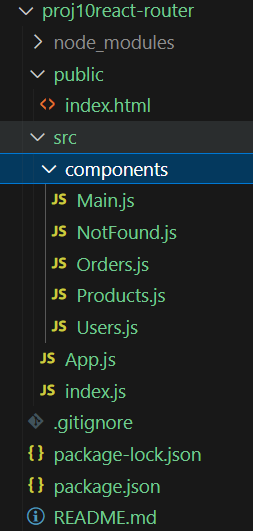
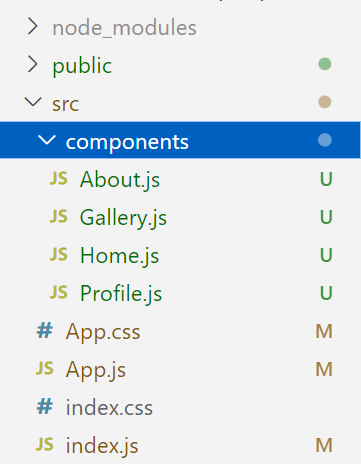

# React Router 사용

## 리액트 라우트 모듈 설치

- 리액트 라우터 버전 5와 6은 크게 다르다.
- 리액트 라우터 최신 버전으로 설치

```bash
npm -S react-router-dom@latest
```

## 공식 사이트 참고

- [https://reactrouter.com/en/main/start/overview](https://reactrouter.com/en/main/start/overview)
- [https://www.w3schools.com/react/react_getstarted.asp](https://www.w3schools.com/react/react_getstarted.asp)

## 새 프로젝트

- 새 리액트 프로젝트를 생성하고
- 리액트 라우터에 사용할 콤포넌트들을  components 디렉토리에 생성



- Main.js
    - Link가 들어가는 부분

```jsx
import { Link } from "react-router-dom";

const Main = (props) => {
    return (<>
        <nav>
            <Link to="/">홈</Link> | 
            <Link to="/products">상품</Link> | 
            <Link to="/users">사용자</Link> | 
            <Link to="/orders">주문</Link>
        </nav>
    </>);
}

export default Main;
```

- NotFound.js
    - 콤포넌트가 없는  path 요청 시 보여지는 내용

```jsx
import { Link } from "react-router-dom";

const Main = (props) => {
    return (<>
        <h3>404 Error: 존재하지 않는 페이지 요청!</h3>
    </>);
}

export default Main;
```

- Orders.js
    - 각각의 내용들

```jsx
const Orders = ()=>{
    return (<>
        <h3>주문페이지 입니다!</h3>
    </>);
}

export default Orders;
```

- Products.js

```jsx
const Products = ()=>{
    return (<>
        <h3>상품페이지 입니다!</h3>
    </>);
}

export default Products;
```

- Users.js

```jsx
const Users = ()=>{
    return (<>
        <h3>사용자페이지 입니다!</h3>
    </>);
}

export default Users;
```

- Home.js
    - 기본 index 화면

```jsx
const Home = ()=>{
    return (<>
        <h3>홈페이지 입니다!</h3>
    </>);
}

export default Home;
```

## App 콤포넌트에서 적용

- App.js
    - BrowserRouter 콤포넌트가 사용되는 부분

```jsx
import { BrowserRouter, Route, Routes } from "react-router-dom";
import Layout from "./components/Layout";
import Home from "./components/Home";
import Products from "./components/Products";
import Users from "./components/Users";
import Orders from "./components/Orders";

const App = () => {
    return (<>
        <BrowserRouter>
            <Routes>
                <Route path="/" element={<Layout /> }>
                    <Route index element={<Home /> } />
                    <Route path="products" element={<Products /> } />
                    <Route path="users" element={<Users /> } />
                    <Route path="orders" element={<Orders /> } />
                </Route>
            </Routes>
        </BrowserRouter>
    </>);
};

export default App;
```

### 실행 예시


---

# 연습 문제:

### 리액트 라우팅과 상태 관리 라이브러리

1. React Router를 사용하여 다중 페이지 애플리케이션을 개발해보세요. 예를 들어, 홈 페이지, 사용자 프로필 페이지, 설정 페이지 등을 각각의 경로에 매핑하여 구현해보세요.
2. React Router의 URL 매개변수를 활용하여 동적 경로 매칭을 구현해보세요. 예를 들어, 사용자 프로필 페이지에서 특정 사용자의 프로필을 보여줄 때, URL에 사용자 ID를 포함하여 해당 사용자의 프로필을 렌더링해보세요.

### 디렉토리 구성



### 실행 예시


---

# 도전 문제

- 다음과 같은 기능을 React Roouter 를 활용해서 구현 해 본다.

### 프로젝트 디렉토리  구조


### 실행 예시

