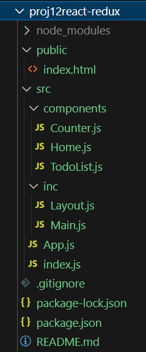

# React Redux 사용하기

React 프로젝트에서 Redux를 이용해서 state 데이터 관리 

# 프로젝트를 React Router 이용해서 구성

- React-Router를 이용해서 예제 콤포넌트를 여러개 사용 하도록 페이징 처리 한다.

## npm 업데이트 및 의존성 사용

```bash
# npm 업데이트
npm install -g npm
npm update

# 최신 버전 설치 시 @latest를 붙인다.
npm i -S react-router-dom@latest

# 또는
npm i -S react-router-dom

# npm 캐시 클리어
npm cache clean --force
npm install

# npm에 문제가 있을 시 yarn으로 대체
npm install -g yarn
yarn install
```

### 프로젝트 폴더 구성



### Main.js

```jsx
// src/inc/Main.js
import { Link } from "react-router-dom";

const Main = (props) => {
    return (<>
        <nav>
            <Link to="/">홈</Link> | 
            <Link to="/counter">Counter</Link> | 
            <Link to="/todo">TodoList</Link>
        </nav>
    </>);
}

export default Main;
```

### Layout.js

```jsx
// src/inc/Layout.js
import { Outlet } from "react-router-dom";
import Main from "./Main";

const Layout = (props) => {
    return (<>
        <header>
            <h1>Comstudy School</h1>
            <Main />
        </header>
        <main>
            <Outlet />
        </main>
        <footer>
            <address>서울시 종로구 견지동 KOSTA</address>
        </footer>
    </>);
}

export default Layout;
```

### Home.js

```jsx
// src/components/Home.js
const Home = ()=>{
    return (<>
        <h3>홈페이지 입니다!</h3>
    </>);
}

export default Home;
```

### Counter.js

```jsx
// src/components/Counter.js
const Home = ()=>{
    return (<>
        <h3>Counter 페이지 입니다!</h3>
    </>);
}

export default Home;
```

### TodoList.js

```jsx
// src/components/TodoList.js
const Home = ()=>{
    return (<>
        <h3>TodoList 페이지 입니다!</h3>
    </>);
}

export default Home;
```

### App.js

```jsx
import { BrowserRouter, Route, Routes } from "react-router-dom";
import Layout from "./inc/Layout";
import Home from "./components/Home";
import Counter from "./components/Counter";
import TodoList from "./components/TodoList";

const App = () => {
    return (<>
        <BrowserRouter>
            <Routes>
                <Route path="/" element={<Layout /> }>
                    <Route index element={<Home /> } />
                    <Route path="counter" element={<Counter /> } />
                    <Route path="todo" element={<TodoList /> } />
                </Route>
            </Routes>
        </BrowserRouter>
    </>);
}

export default App;
```


# React Redux 사용

### Redux 관련 의존성 모듈 설치

```bash
npm install redux 
npm install react-redux
npm install @reduxjs/toolkit

# 또는
npm i -S redux react-redux @reduxjs/toolkit
```

### 스토어 설정

reduxjs toolkit을 사용해서 간편하게 설정 가능.

- store.js

```jsx
// src/redux/store.js
// store에는 사용할 state가 들어가고 
// 그 state를 사용하는 메서드가 reducers 추가.

import { configureStore, createSlice } from "@reduxjs/toolkit";

// Slice
const counterSlice = createSlice({
    name: "",
    initialState: {
        count: 0
    },
    reducers: {
        increment: (state) => {
            state.count += 1;
        },
        derement: (state) => {
            state.count -= 1;
        }
    }
});

export const {increment, derement} = counterSlice.actions;

// Store
const store = configureStore({
    reducer: {
        counter: counterSlice.reducer
    }
});

// 모듈 등록
export default store;
```

- **createSlice** : Redux Toolkit의 핵심 기능. 액션 생성자와 액션 타입, 리듀서를 한번에 생성 해주는 함수.
- **configureStore**: 스토어 설정 단순화. Redux DevTools Extension과 같은 미들웨어를 자동 설정.

### index.js 페이지에 Provider 적용

- 모든 컴포넌트에서 store를 사용 할 수 있도록 설정.

```jsx
// src/index.js
import ReactDOM from "react-dom/client";
import App from "./App";
**import { Provider } from "react-redux";
import store from './redux/store';**

const container = document.getElementById("root");
const root = ReactDOM.createRoot(container);
root.render(**<Provider store={store}><App /></Provider>** );
```

### 컴포넌트에서 카운터 모듈 사용

- **useSelector 훅**: 사용 할 스테이트를 참조하게 한다.
- **useDispatch()  훅**: 사용 할 리듀서 함수를 참조하게 한다.

```jsx
import { useDispatch, useSelector } from "react-redux";
import { derement, increment } from "../redux/store";

// src/components/Counter.js
const Counter = ()=>{
    const count = useSelector( state => state.counter.count);
    const dispatch = useDispatch();

    return (<>
        <h3>Counter 페이지 입니다!</h3>
        <h1>Count: {count}</h1>
        <button onClick={ (e)=> dispatch(increment() ) }>증가</button>
        <button onClick={ (e)=> dispatch(derement() ) }>감소</button>
    </>);
}

export default Counter;
```

### 실행 결과


# store 분리하기

- 여러 기능의 store를 분리 한다.
- 각각 리듀서를 분리해서 store.js에서 병합 한다.

### store_counter.js

```jsx
import { createSlice } from '@reduxjs/toolkit';

export const counterSlice = createSlice({
  name: 'counter',
  initialState: { count: 0 },
  reducers: {
    increment: state => {
      state.count += 1;
    },
    decrement: state => {
      state.count -= 1;
    }
  }
});

export const { increment, decrement } = counterSlice.actions;
export default counterSlice.reducer;
```

### store_todo.js

```jsx
import { createSlice } from '@reduxjs/toolkit';

export const todosSlice = createSlice({
  name: 'todos',
  initialState: [],
  reducers: {
    addTodo: {
      reducer: (state, action) => {
        state.push(action.payload);
      },
      prepare: (content) => {
        const id = Math.random().toString(36).substring(2);
        return { payload: { id, content, completed: false } };
      }
    },
    toggleTodo: (state, action) => {
      const todo = state.find(todo => todo.id === action.payload);
      if (todo) {
        todo.completed = !todo.completed;
      }
    },
    removeTodo: (state, action) => {
      return state.filter(todo => todo.id !== action.payload);
    }
  }
});

export const { addTodo, toggleTodo, removeTodo } = todosSlice.actions;
export default todosSlice.reducer;
```

### store.js

```jsx
// src/redux/store.js
// store에는 사용할 state가 들어가고 
// 그 state를 사용하는 메서드가 reducers 추가.

import { configureStore } from "@reduxjs/toolkit";
import todoReducer, { addTodo, removeTodo, toggleTodo } from "./store_todo";
import counterReducer, { increment, derement} from "./store_counter";

export  {increment, derement, addTodo, removeTodo, toggleTodo }

// Store에서 여러 기능들의 리듀서를 병함
const store = configureStore({
    reducer: {
        counter: counterReducer,
        todos: todoReducer
    }
});

// 모듈 등록
export default store;
```

## TodoList 콤포넌트에서 todos 스토어의  state와 리듀서 사용.

- useSelector, useDispatch를 이용해서 store의 내용을 사용.

```jsx
// src/components/TodoList.js
import React, { useState } from 'react';
import { useSelector, useDispatch } from 'react-redux';
import { addTodo, toggleTodo, removeTodo } from '../redux/store';

function TodoList() {
  const [input, setInput] = useState('');
  const todos = useSelector(state => state.todos);
  const dispatch = useDispatch();

  const handleSubmit = e => {
    e.preventDefault();
    if (input.trim()) {
      dispatch(addTodo(input));
      setInput('');
    }
  };

  return (
    <div>
      <h1>Todo List</h1>
      <form onSubmit={handleSubmit}>
        <input
          type="text"
          value={input}
          onChange={e => setInput(e.target.value)}
          placeholder="Add a new todo"
        />
        <button type="submit">Add</button>
      </form>
      <ul>
        {todos.map(todo => (
          <li key={todo.id} style={{ textDecoration: todo.completed ? 'line-through' : 'none' }}>
            {todo.content}
            <button onClick={() => dispatch(toggleTodo(todo.id))}>Toggle</button>
            <button onClick={() => dispatch(removeTodo(todo.id))}>Remove</button>
          </li>
        ))}
      </ul>
    </div>
  );
}

export default TodoList;
```

### 실행 결과


# 리액트 컴포넌트 드래그 앤 드랍 기능

- React Redux와 react-dnd를 이용해서 컴포넌트 움직이기

### 리액트 드래그 앤 드롭 모듈 설치

- react-dnd : 리액트에서 드래그 앤 드랍 기능 모듈

```bash
npm install react-dnd react-dnd-html5-backend 
npm install @reduxjs/toolkit react-redux
```

### 콤포넌트 추가

- DraggableComponent.js

```jsx

const DraggableComponent = () => {
    return (<>
        <h3>컴포넌트를 마우스로 드래그 하기</h3>
    </>);
}

export default DraggableComponent;
```

### 라우터에 링크 적용

- Main.js

```jsx
// src/inc/Main.js
import { Link } from "react-router-dom";

const Main = (props) => {
    return (<>
        <nav>
            <Link to="/">홈</Link> | 
            <Link to="/counter">Counter</Link> | 
            <Link to="/todo">TodoList</Link> |
            **<Link to="/dnd">드래그앤드롭</Link>**
        </nav>
    </>);
}

export default Main;
```

- App.js에 <Route> 콤포넌트 추가

```jsx

```

### 드래그 할 요소와 CSS 선언

- DraggableComponent.css

```css
div.box {
    width: 100px;
    height: 100px;
    background-color: 'pink';
    position: absolute;
    left: 100px;
    top: 100px;
}
```

- DraggableComponent.js

```jsx
import "./DraggableComponent.css";

const DraggableComponent = () => {
    return (<>
        <h3>컴포넌트를 마우스로 드래그 하기</h3>
        <div class="box">드래그 하세요.</div>
    </>);
}

export default DraggableComponent;
```

### 드래그 앤 드롭 기능 적용

- DraggableComponent.js

```css
import "./DraggableComponent.css";
import React from 'react'
import { setPosition } from "../redux/store_dnd";
import { useDispatch, useSelector } from "react-redux";
import { useDrag } from "react-dnd";

const DraggableComponent = () => {
    const position = useSelector( state => state.position );
    const dispatch = useDispatch();

    const positionData = {
        type: 'box',
        item: {id: 'draggable-box'}, 
        collect: (monitor) => ({isDragging: monitor.isDragging()}),
        end: (item, monitor) => {
            const delta = monitor.getDifferenceFromInitialOffset();
            id(delta) {
                const newX = Math.round(position.x + delta.x);
                const newY = Math.round(postion.y + delta.y);
                dispatch(setPosition({x:newX, y:newY}));
            }
        }
    };

    const [{isDragging }, dragRef ] = useDrag(()=>positionData );

    return (<>
        <h3>컴포넌트를 마우스로 드래그 하기</h3>
        <div ref={dragRef} className="box" style={{
            left: `${position.x}px`,
            top: `${position.y}px`,
            opacity: isDragging ? 0.5 : 1
        }}>Drag me</div>
    </>);
}

export default DraggableComponent;
```

### DnD 프로바이더 설정

- App.js

```jsx
import { BrowserRouter, Route, Routes } from "react-router-dom";
import Layout from "./inc/Layout";
import Home from "./components/Home";
import Counter from "./components/Counter";
import TodoList from "./components/TodoList";
import DraggableComponent from "./components/DraggableComponent";
import { DndProvider } from "react-dnd";
import { HTML5Backend } from "react-dnd-html5-backend";

const App = () => {
    return (<>
        <BrowserRouter>
            <Routes>
                <Route path="/" element={<Layout /> }>
                    <Route index element={<Home /> } />
                    <Route path="counter" element={<Counter /> } />
                    <Route path="todo" element={<TodoList /> } />
                    <Route path="dnd" element={<DndProvider backend={HTML5Backend}><DraggableComponent /></DndProvider> } />
                </Route>
            </Routes>
        </BrowserRouter>
    </>);
}

export default App;
```