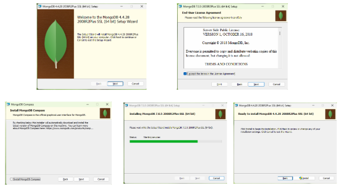

# Node.js MongoDB 연동

몽고디비는 로컬에 직접 설치하거나 클라우드 환경에서 사용가능.

# 1. 몽고디비 사용법

## **1.1 MongoDB 설치 및 설정**

### **로컬 설치**:

- MongoDB [공식 사이트](https://www.mongodb.com/try/download/community)에서 다운로드.
    - [https://www.mongodb.com/try/download/community](https://www.mongodb.com/try/download/community)
- 설치 후 터미널에서 `mongod` 명령어로 MongoDB 서버 실행.
- 기본적으로 `localhost:27017`에서 연결됨.



### **MongoDB Shell 설치**:

- MongoDB CLI 명령어를 사용하기 위해 **mongosh** 설치 필요.
- 설치 후 터미널에서 `mongosh` 명령어 입력하여 MongoDB 쉘 실행.


- 구글에서 mognoshell  dowload 검색
    - [https://www.mongodb.com/try/download/shell](https://www.mongodb.com/try/download/shell)
- mongodb와 monogsh를 설치 하고 터미널을 열어서 접속.

```jsx
Microsoft Windows [Version 10.0.19045.4894]
(c) Microsoft Corporation. All rights reserved.

C:\Users\beomj>**mongosh --version**
2.3.1

C:\Users\beomj>**mongosh**
Current Mongosh Log ID: 67032ccd327f78549bc73bf7
Connecting to:          mongodb://127.0.0.1:27017/?directConnection=true&serverSelectionTimeoutMS=2000&appName=mongosh+2.3.1
Using MongoDB:          8.0.0
Using Mongosh:          2.3.1

For mongosh info see: https://www.mongodb.com/docs/mongodb-shell/

To help improve our products, anonymous usage data is collected and sent to MongoDB periodically (https://www.mongodb.com/legal/privacy-policy).
You can opt-out by running the disableTelemetry() command.

------
   The server generated these startup warnings when booting
   2024-10-07T09:23:48.241+09:00: Access control is not enabled for the database. Read and write access to data and configuration is unrestricted
------

test>
```

- 몽고디비 문서 참고: [https://www.mongodb.com/ko-kr/docs/mongodb-shell/](https://www.mongodb.com/ko-kr/docs/mongodb-shell/)
- w3schools의 튜토리얼: [https://www.w3schools.com/mongodb/index.php](https://www.w3schools.com/mongodb/index.php)

### **MongoDB와 RDBMS의 데이터 형식 및 용어 비교**


| **개념/용어** | **RDBMS** (관계형 데이터베이스) | **MongoDB** (NoSQL) |
| --- | --- | --- |
| **Database** | Database | Database |
| **Table** | Table | Collection |
| **Row/Record** | Row | Document |
| **Column** | Column | Field |
| **Primary Key** | Primary Key | `_id` (자동 생성되는 기본 키) |
| **Join** | Join (복잡한 쿼리로 테이블 간 관계를 설정) | Embedding/Referencing (내장 또는 참조 방식으로 연결) |
| **Schema** | 고정 스키마 (Schema) | 동적 스키마 (Schema-less) |
| **SQL** | Structured Query Language (SQL) | MongoDB Query Language (MQL) |
| **Transaction** | ACID Transactions | 지원 (MongoDB 4.0부터 다중 문서 트랜잭션) |

### **주요 쿼리 문법 비교 (RDBMS vs MongoDB)**

| **작업** | **RDBMS (SQL)** | **MongoDB (MQL)** |
| --- | --- | --- |
| **데이터베이스 선택** | `USE database_name;` | `use database_name;` |
| **테이블/컬렉션 생성** | `CREATE TABLE table_name (...);` | `db.createCollection('collection_name');` |
| **데이터 삽입** | `INSERT INTO table_name (...) VALUES (...);` | `db.collection_name.insertOne({...});` |
| **데이터 조회** | `SELECT * FROM table_name;` | `db.collection_name.find();` |
| **조건부 조회** | `SELECT * FROM table_name WHERE condition;` | `db.collection_name.find({ condition });` |
| **데이터 수정** | `UPDATE table_name SET column = value WHERE condition;` | `db.collection_name.updateOne({ condition }, { $set: { field: value } });` |
| **데이터 삭제** | `DELETE FROM table_name WHERE condition;` | `db.collection_name.deleteOne({ condition });` |

### **MongoDB에서 다루는 데이터의 종류**

MongoDB에서 다루는 데이터는 다양한 형식의 **문서(Document)**로 저장되며, 자바스크립트의 객체처럼 **BSON** 형식(바이너리 JSON)으로 표현됨. 주요 데이터 타입은 다음과 같음:

| **MongoDB 데이터 타입** | **설명** |
| --- | --- |
| **String** | 문자열 데이터 |
| **Number** | 숫자 데이터 (32비트 정수, 64비트 정수 등) |
| **Boolean** | 참(True) 또는 거짓(False) |
| **Array** | 배열 형태의 데이터 (여러 값을 리스트 형태로 저장) |
| **Object** | JSON 객체 (중첩된 데이터 구조 표현 가능) |
| **ObjectId** | MongoDB에서 자동으로 생성되는 고유 ID 값 |
| **Date** | 날짜 및 시간 데이터 |
| **Null** | 빈 값을 표현하는 데이터 |

## 몽고 디비 사용

- 몽고디비 설치 확인 (몽고쉘 사용)
    - mongosh
- 데이터베이스 지정 (use 명령어를 사용 하면 DB 자동 생성 or 선택)
    - use local
- db에 users 컬렉션 만들고 문서 insert
    - db.users.insertOne({name:'방탄소년단', age:21})
- users컬렉션에 있는 모든 문서 객체를 반환
    - db.users.find()
    - db.users.find({},{_id:false})

```bash
local> db.users.find();
[
  { _id: ObjectId('67033448b43c1ecbdcc73bf8'), name: '뉴진스', age: 18 },
  { _id: ObjectId('670334a6b43c1ecbdcc73bf9'), name: 'BTS', age: 23 }
]
local> db.users.find({_id: ObjectId('67033448b43c1ecbdcc73bf8')});
[ { _id: ObjectId('67033448b43c1ecbdcc73bf8'), name: '뉴진스', age: 18 } ]
local> db.users.find({name: '뉴진스'});
[ { _id: ObjectId('67033448b43c1ecbdcc73bf8'), name: '뉴진스', age: 18 } ]
local> db.users.find({name: '뉴진스'}, {_id: false});
[ { name: '뉴진스', age: 18 } ]
local> db.users.find({}, {_id: false});
[ { name: '뉴진스', age: 18 }, { name: 'BTS', age: 23 } ]
local>
```

## **1.2 기본 CRUD 작업**

### **MongoDB 실행**:

- `mongosh` 명령어로 MongoDB 쉘 실행.

### **데이터베이스 생성 및 확인**:

- `use [데이터베이스명]`으로 데이터베이스 선택 및 생성.
    
    ```bash
    use vehicle  # vehicle이라는 데이터베이스 생성
    db           # 현재 사용 중인 데이터베이스 확인
    
    ```
    

### **컬렉션에 데이터 저장**:

db.컬렉션.insertOne({}) 명령 사용.

- `insertOne()`으로 단일 데이터 삽입.
    
    ```bash
    db.car.insertOne({name: 'SM5', price: 3000, company: 'SAMSUNG', year: 2023});
    
    ```
    
- `insertMany()`으로 여러 데이터 삽입.
    
    ```bash
    db.car.insertMany([
      {name: 'Sonata', price: 3500, company: 'HYUNDAI', year: 2022},
      {name: 'BMW', price: 6000, company: 'BMW', year: 2022},
      {name: 'K7', price: 4000, company: 'KIA', year: 2023}
    ]);
    
    ```
    

### **데이터 조회**:

- **모든 데이터 조회**:
    
    ```bash
    db.car.find();  # 컬렉션에 있는 모든 문서 반환
    
    ```
    
- **특정 필드만 조회**:
    
    ```bash
    db.car.find({}, {_id: false});  # _id 제외하고 모든 필드 조회
    db.car.find({name: 'K7'}, {_id: false});
    
    ```
    

### **조건에 따른 조회**:

- **이상/초과**:
    
    ```bash
    db.car.find({price: {$gte: 3500}}, {_id: false});  # 가격이 3500 이상
    db.car.find({price:{$gt:3500}},{_id:false});
    ```
    
- **이하/미만**:
    
    ```bash
    db.car.find({price: {$lte: 3500}}, {_id: false});  # 가격이 3500 이하
    db.car.find({price:{$lt:3500}},{_id:false});
    ```
    
- **검색 개수**:
    
    ```bash
    db.car.find({price: {$gte: 3500}}, {_id: false}).**count()**;
    ```
    
- **하나만 검색**:
    
    ```bash
    db.car.findOne();  # 첫 번째 도큐먼트 반환
    ```
    

### **정렬**:

- **오름차순 및 내림차순 정렬**:
    
    ```bash
    db.car.find().sort({name: 1});  # 이름 오름차순 정렬
    db.car.find({}, {_id: false}).sort({name: -1});  # 이름 내림차순
    db.car.find({}, {_id: false}).sort({price: -1});  # 가격 내림차순
    
    ```
    

## **1.3 데이터 수정 및 삭제**

### **도큐먼트 수정**

- **단일 도큐먼트 수정**
    
    ```bash
    db.car.updateOne({name: 'K7'}, {$set: {price: 1000}});
    ```
    
- **여러 도큐먼트 수정**
    
    ```bash
    db.car.updateMany({price: {$lte: 3500}}, {$set: {price: 1000}});
    ```
    

### **도큐먼트 삭제**

- **단일 삭제**
    
    ```bash
    db.car.deleteOne({price: {$lte: 1000}});
    ```
    
- **여러 삭제**
    
    ```bash
    db.car.deleteMany({price: {$lte: 3500}});
    ```
    

## **1.4 기타 명령어**

- **새로운 컬렉션 생성**
    
    ```bash
    db.createCollection('newCar');
    ```
    
- **모든 컬렉션 목록 보기**
    
    ```bash
    db.getCollectionNames();
    ```
    
- **컬렉션 삭제**
    
    ```bash
    db.car.drop();
    ```
    
- **현재 데이터베이스 삭제**
    
    ```bash
    db.dropDatabase();
    ```
    
- **MongoDB 쉘 종료**
    
    ```bash
    exit;
    ```
    
- **모든 database 보기**
    
    ```bash
    show dbs
    ```
    

### 몽고디비 CRUD 명령어 실습이 끝나면 다음 단계 진도를 위해 car 컬렉션을 만들고 모든 데이터를 다시 채워 둡니다.

# **MongoDB 연동 모듈 소개**

- **mongojs**는 가장 간단하고 원시적인 MongoDB 드라이버로, 콜백 기반으로 사용하며, 빠르게 MongoDB와 연동할 수 있음.
- **MongoDB Native Driver**는 최신 MongoDB 기능을 직접 사용할 수 있는 **강력한 모듈**로, **Async/Await** 기반으로 비동기 작업을 쉽게 처리할 수 있음.
- **Mongoose**는 스키마를 이용해 데이터 모델을 명확히 정의하고, 검증 및 ODM 기능을 제공해 복잡한 애플리케이션에서 유용함.

각 모듈의 특징을 고려해 프로젝트의 필요에 맞는 드라이버를 선택하여 사용하는 것이 중요함.

## **1. mongojs**

### **설치 및 사용법**

- **설치**
    
    ```bash
    npm install mongojs --save
    ```
    
- **Mongojs를 사용한 MongoDB 연동**
    
    ```jsx
    // app.js
    const mongojs = require('mongojs');
    const db = mongojs('vehicle', ['car']);
    
    db.car.find(function(err, data) {
      console.log(data);
    });
    
    ```
    
- **서버 실행 결과**
    
    ```bash
    D:\workspace-nodejs\proj14mongodb>node app.js
    [
      {
        _id: 6703377fb43c1ecbdcc73bfa,
        name: 'SM8',
        price: 3500,
        company: 'SAMSUNG',
        year: 2020
      },
      {
        _id: 6703380db43c1ecbdcc73bfb,
        name: 'Sonata',
        price: 3500,
        company: 'HYUNDAI',
        year: 2022
      },
      {
        _id: 6703380db43c1ecbdcc73bfc,
        name: 'BMW',
        price: 6000,
        company: 'BMW',
        year: 2022
      },
      {
        _id: 6703380db43c1ecbdcc73bfd,
        name: 'K7',
        price: 4000,
        company: 'KIA',
        year: 2023
      }
    ]
    ```
    

### http모듈과 Mongojs 모듈 사용

```bash
// app.js 수정
const http = require('http');
const mongojs = require('mongojs');
const db = mongojs('vehicle', ['car']);

const server = http.createServer((req, res)=>{
    db.car.find(function(err, data) {
        let html = "<table border='1'>";
        data.forEach((car, idx)=>{
            html+=`<tr><td>${car.name}</td>
                <td>${car.price}</td>
                <td>${car.company}</td>
                <td>${car.year}</td></tr>`;
        });
        html += "</table>";
        res.end(html);
    });
});

server.listen(3000, ()=>{
    console.log('서버 실행 중 http://localhost:'+3000);
});
```

- 서버 실행 후 브라우저에서 확인
    
    
    

### **Express와 Mongojs를 함께 사용**

- npm i express
    
    ```bash
    const http = require('http');
    const express = require('express');
    const app = express();
    
    const mongojs = require('mongojs');
    const db = mongojs('vehicle', ['car']);
    app.set('port', 3000);
    
    app.get('/car', (req, res)=>{
        db.car.find(function(err, data) {
            let html = "<table border='1'>";
            data.forEach((car, idx)=>{
                html+=`<tr><td>${car.name}</td>
                    <td>${car.price}</td>
                    <td>${car.company}</td>
                    <td>${car.year}</td></tr>`;
            });
            html += "</table>";
            res.end(html);
        });
    });
    
    const server = http.createServer(app);
    server.listen(app.get('port'), ()=>{
        console.log(`서버 실행 중 http://localhost:${app.get('port')}`);
    });
    ```
    

### ejs 뷰엔진에 목록 보이게 수정

- 모듈 설치

```bash
npm install -S ejs
```

- ejs 모듈을 설치하고  views 디렉토리 생성 후 CarList.html 파일 준비
    
    ```html
    <!DOCTYPE html>
    <html lang="en">
    <head>
        <meta charset="UTF-8">
        <meta name="viewport" content="width=device-width, initial-scale=1.0">
        <title>Document</title>
    </head>
    <body>
        <table border="1" width="100%">
            <tr>
                <th>NO</th>
                <th>NAME</th>
                <th>PRICE</th>
                <th>COMPANY</th>
                <th>YEAR</th>
            </tr>
        <%
            carList.forEach((car, idx) => {
        %>
            <tr>
                <td><%=idx %></td>
                <td><%=car.name %></td>
                <td><%=car.price %></td>
                <td><%=car.company %></td>
                <td><%=car['year'] %></td>
            </tr>
        <%
            });
        %>
        </table>
    </body>
    </html>
    ```
    
- app.js에 ejs  뷰엔진 설정 후   렌더링 하기
    
    ```jsx
    const http = require('http');
    const express = require('express');
    const app = express();
    const path = require('path');
    
    const mongojs = require('mongojs');
    const db = mongojs('vehicle', ['car']);
    
    app.set('port', 3000);
    app.set('view engine', 'ejs');
    app.set('views', path.join(__dirname, "views"));
    
    app.get('/car', (req, res)=>{
        db.car.find(function(err, data) {
            req.app.render('CarList', {carList: data}, (err, html)=>{
                if (err) throw err;
                res.end(html);
            });
        });
    });
    
    const server = http.createServer(app);
    server.listen(app.get('port'), ()=>{
        console.log(`서버 실행 중 http://localhost:${app.get('port')}`);
    });
    ```
    

## **2. MongoDB Native Driver**

- 참조 문서
    - [https://www.npmjs.com/package/mongodb](https://www.npmjs.com/package/mongodb)
    - [https://www.mongodb.com/languages/mongodb-with-nodejs](https://www.mongodb.com/languages/mongodb-with-nodejs)
    - [https://www.npmjs.com/package/mongodb?activeTab=readme](https://www.npmjs.com/package/mongodb?activeTab=readme)

### **설치 및 사용법**

- **설치**:
    
    ```bash
    npm install mongodb --save
    
    ```
    
- **MongoClient 연결**:
    
    ```jsx
    const { MongoClient } = require("mongodb");
    const uri = "mongodb://localhost:27017";
    const client = new MongoClient(uri);
    const dbName = "vehicle";
    const collectionName = "car";
    
    ```
    

### **MongoDB Client 예제 (Async/Await 사용)**

- 최신 MongoDB모듈에서는 콜백함수 사용 안됨.
    
    ```jsx
    const { MongoClient } = require("mongodb");
    const client = new MongoClient("mongodb://127.0.0.1");
    const dbName = "vehicle";
    const collectionName = "car";
    
    async function run() {
      try {
        await client.connect();  // 클라이언트 연결
        const db = client.db(dbName);
        const car = db.collection(collectionName);
        const cursor = car.find({}, { projection: { _id: 0 } });
        await cursor.forEach(console.log);  // 데이터 출력
        console.log("Connected successfully to server");
      } finally {
        await client.close();  // 연결 종료
      }
    }
    
    run().catch(console.dir);
    
    ```
    

### MongoClient 결과 cursor객체에서 carArray 목록 가져오기

```jsx
const http = require('http');
const express = require('express');
const app = express();
const path = require('path');
const {MongoClient} = require('mongodb');

app.use(express.json());
app.use(express.urlencoded({extended: false}));
app.use("/", express.static(path.join(__dirname, "public")));

app.set('port', 3000);
app.set('view engine', 'ejs');
app.set('views', path.join(__dirname, "views"));

// db 준비 및 연동
const dbClient = new MongoClient("mongodb://localhost:27017");
const dbName = "vehicle";
const collectionName = "car";

// 목록 출력
app.get('/car', async (req, res)=>{
    try{
        await dbClient.connect();
        const db = dbClient.db(dbName);
        const cars = db.collection(collectionName);
        const cursor = cars.find({},{sort:{name:1}, projection:{}});
        
        // for await (const doc of cursor) {
        //     console.log(doc);
        // }
        console.log(await cursor.toArray());

        res.end("DB 준비 완료!");
    } finally {
        await dbClient.close();
    }
});

// DB에 데이터 저장
app.post('/car', (req, res)=>{
    try{
        dbClient.connect();
    } finally {
        dbClient.close();
    }
});

const server = http.createServer(app);
server.listen(app.get('port'), ()=>{
    console.log(`서버 실행 중 http://localhost:${app.get('port')}`);
});
```

### 뷰엔진으로 forward 처리 해 주는 함수 선언

```jsx
// 단순 forward 처리 함수
const forward = (req, res,target, obj)=>{
    req.app.render(target, obj, (err, html) => {
        if(err) throw err;
        res.end(html);
    });
}

// 새 데이터 입력 페이지로 forward
**app.get('/car/input', (req, res)=>{
    forward(req, res,'CarInput', {});
});**
```

### 상세 보기 페이지로 forwad

- 파라미터로 전달 받은 id를 이용해서 db에서 car를 검색 한다.
- forward 될 때 인자로 car 데이터를 전달 한다.

```jsx
// 상세보기 페이지로 forward
app.get('/car/detail', async (req, res)=>{
    // 파라미터로 id를 받고 
    // id와 같은 car를 db에서 검색
    try{
        await dbClient.connect();
        const db = dbClient.db(dbName);
        const cars = db.collection(collectionName);
        const car = await cars.findOne({_id: new ObjectId(req.query.id)},{});
        // 사용자 정의 forward 함수 사용.
        forward (req, res, 'CarDetail', {car});
    } finally {
        await dbClient.close();
    }

    // 검색 된 car를 뷰에서 출력.
    const car = {_id:0}
    forward(req, res,'CarDetail', {car});
});
```

### car 삭제 후 list로 redirection

```jsx
// car 삭제 후 list로 redirection
app.get('/car/delete', async (req, res)=>{
    try{
        await dbClient.connect();
        const db = dbClient.db(dbName);
        const cars = db.collection(collectionName);
        await cars.deleteOne({_id: new ObjectId(req.query.id)});
        res.redirect("/car");
    } finally {
        await dbClient.close();
    }
});
```

### 데이터 입력 후 목록으로 redirect

```jsx
// DB에 데이터 저장
app.post('/car', async (req, res)=>{
    try{
        await dbClient.connect();
        // 전달 된 데이터를 body에서 가져오기
        // 받아온 데이터를 db에 저장
        // 저장 후 목록으로 redirect
        const db = dbClient.db(dbName);
        const cars = db.collection(collectionName);
        const {name, price, company, year} = req.body;
        await cars.insertOne({name, price, company, year});
        res.redirect("/car");
    } finally {
        dbClient.close();
    }
});
```

### 수정 페이지로 forward

```jsx
// 상세보기 페이지로 forward
app.get('/car/modify', async (req, res)=>{
    try{
        await dbClient.connect();
        const db = dbClient.db(dbName);
        const cars = db.collection(collectionName);
        const car = await cars.findOne({_id: new ObjectId(req.query.id)},{});
        forward (req, res, 'CarModify', {car});
    } finally {
        await dbClient.close();
    }
});
```

### 수정 후 목록으로 redirection

```jsx
// DB에 데이터 수정
// bodyParser 미들웨어가 먼저 준비 되어야 합니다. 
app.post('/car/modify', async (req, res)=>{
    try{
        await dbClient.connect();
        const {id, name, price, company, year} = req.body;
        const db = dbClient.db(dbName);
        const cars = db.collection(collectionName);
        await cars.updateOne({_id: new ObjectId(id)}, {$set:{name, price, company, year}});
        res.redirect("/car");
    } finally {
        dbClient.close();
    }
});
```

## 전체 소스코드

- app.js
    
    ```jsx
    const http = require('http');
    const express = require('express');
    const app = express();
    const path = require('path');
    const {MongoClient, ObjectId} = require('mongodb');
    
    app.use(express.json());
    app.use(express.urlencoded({extended: false}));
    app.use("/", express.static(path.join(__dirname, "public")));
    
    app.set('port', 3000);
    app.set('view engine', 'ejs');
    app.set('views', path.join(__dirname, "views"));
    
    // db 준비 및 연동
    const dbClient = new MongoClient("mongodb://localhost:27017");
    const dbName = "vehicle";
    const collectionName = "car";
    
    // 목록 출력
    app.get('/car', async (req, res)=>{
        try{
            await dbClient.connect();
            const db = dbClient.db(dbName);
            const cars = db.collection(collectionName);
            const cursor = cars.find({},{sort:{name:1}, projection:{}});
            
            // for await (const doc of cursor) {
            //     console.log(doc);
            // }
            const carList = await cursor.toArray();
            req.app.render('CarList', {carList: carList}, (err, html)=>{
                if (err) throw err;
                res.end(html);
            });
        } finally {
            await dbClient.close();
        }
    });
    
    // DB에 데이터 저장
    app.post('/car', async (req, res)=>{
        try{
            await dbClient.connect();
            // 전달 된 데이터를 body에서 가져오기
            // 받아온 데이터를 db에 저장
            // 저장 후 목록으로 redirect
            const db = dbClient.db(dbName);
            const cars = db.collection(collectionName);
            const {name, price, company, year} = req.body;
            await cars.insertOne({name, price, company, year});
            res.redirect("/car");
        } finally {
            dbClient.close();
        }
    });
    
    // DB에 데이터 수정
    // bodyParser 미들웨어가 먼저 준비 되어야 합니다. 
    app.post('/car/modify', async (req, res)=>{
        try{
            await dbClient.connect();
            const {id, name, price, company, year} = req.body;
            const db = dbClient.db(dbName);
            const cars = db.collection(collectionName);
            await cars.updateOne({_id: new ObjectId(id)}, {$set:{name, price, company, year}});
            res.redirect("/car");
        } finally {
            dbClient.close();
        }
    });
    
    const forward = (req, res,target, obj)=>{
        req.app.render(target, obj, (err, html) => {
            if(err) throw err;
            res.end(html);
        });
    }
    
    // 새 데이터 입력 페이지로 forward
    app.get('/car/input', (req, res)=>{
        forward(req, res,'CarInput', {});
    });
    
    // 상세보기 페이지로 forward
    app.get('/car/detail', async (req, res)=>{
        // 파라미터로 id를 받고 
        // id와 같은 car를 db에서 검색
        try{
            await dbClient.connect();
            const db = dbClient.db(dbName);
            const cars = db.collection(collectionName);
            const car = await cars.findOne({_id: new ObjectId(req.query.id)},{});
            forward (req, res, 'CarDetail', {car});
        } finally {
            await dbClient.close();
        }
    });
    
    // 상세보기 페이지로 forward
    app.get('/car/modify', async (req, res)=>{
        try{
            await dbClient.connect();
            const db = dbClient.db(dbName);
            const cars = db.collection(collectionName);
            const car = await cars.findOne({_id: new ObjectId(req.query.id)},{});
            forward (req, res, 'CarModify', {car});
        } finally {
            await dbClient.close();
        }
    });
    
    // car 삭제 후 list로 redirection
    app.get('/car/delete', async (req, res)=>{
        try{
            await dbClient.connect();
            const db = dbClient.db(dbName);
            const cars = db.collection(collectionName);
            await cars.deleteOne({_id: new ObjectId(req.query.id)});
            res.redirect("/car");
        } finally {
            await dbClient.close();
        }
    });
    
    const server = http.createServer(app);
    server.listen(app.get('port'), ()=>{
        console.log(`서버 실행 중 http://localhost:${app.get('port')}`);
    });
    ```
    

- views/CarList.ejs
    
    ```jsx
    <!DOCTYPE html>
    <html lang="en">
    <head>
        <meta charset="UTF-8">
        <meta name="viewport" content="width=device-width, initial-scale=1.0">
        <title>Document</title>
    </head>
    <body>
        <h1>컴스터디 중고차 쇼핑몰</h1>
        <a href="/car/input">정보입력</a>
        <table border="1" width="100%">
            <tr>
                <th>NO</th>
                <th>NAME</th>
                <th>PRICE</th>
                <th>COMPANY</th>
                <th>YEAR</th>
            </tr>
        <%
            carList.forEach((car, idx) => {
        %>
            <tr>
                <td><%=idx %></td>
                <td><a href="/car/detail?id=<%=car._id %>"><%=car.name %></a> </td>
                <td><%=car.price %></td>
                <td><%=car.company %></td>
                <td><%=car['year'] %></td>
            </tr>
        <%
            });
        %>
        </table>
    </body>
    </html>
    ```
    
    
    
- views/CarInput.ejs
    
    ```jsx
    <!DOCTYPE html>
    <html lang="en">
    <head>
        <meta charset="UTF-8">
        <meta name="viewport" content="width=device-width, initial-scale=1.0">
        <title>Document</title>
    </head>
    <body>
        <h1>자동차 정보 입력</h1>
        <form action="/car" method="post">
            <table>
                <tr>
                    <th>차종</th>
                    <td><input type="text" name="name" value="카니발"></td>
                </tr>
                <tr>
                    <th>가격</th>
                    <td><input type="text" name="price" value="4500"></td>
                </tr>
                <tr>
                    <th>메이커</th>
                    <td><input type="text" name="company" value="KIA"></td>
                </tr>
                <tr>
                    <th>연식</th>
                    <td><input type="text" name="year" value="2021"></td>
                </tr>
                <tr>
                    <td colspan="2"><input type="submit" value="저장"></td>
                </tr>
            </table>
        </form>
    </body>
    </html>
    ```
    
    
    
- views/CarDetail.js
    
    ```jsx
    <!DOCTYPE html>
    <html lang="en">
    <head>
        <meta charset="UTF-8">
        <meta name="viewport" content="width=device-width, initial-scale=1.0">
        <title>Document</title>
    </head>
    <body>
        <h1>자동차 정보 상세보기</h1>
        <!-- 내용 -->
        <table border="1" width="550">
            <tr>
                <th width="30%">차종</th>
                <td width="70%"><%=car.name %></td>
            </tr>
            <tr>
                <th>가격</th>
                <td><%=car.price %></td>
            </tr>
            <tr>
                <th>메이커</th>
                <td><%=car.company %></td>
            </tr>
            <tr>
                <th>연식</th>
                <td><%=car.year %></td>
            </tr>
        </table>
        <a href="/car">목록</a> | 
        <a href="/car/modify?id=<%=car._id %>">수정</a> | 
        <a href="/car/delete?id=<%=car._id %>">삭제</a>
    </body>
    </html>
    ```
    
    
    
- views/CarModify.js
    
    ```jsx
    <!DOCTYPE html>
    <html lang="en">
    <head>
        <meta charset="UTF-8">
        <meta name="viewport" content="width=device-width, initial-scale=1.0">
        <title>Document</title>
    </head>
    <body>
        <h1>자동차 정보 수정</h1>
        <p>(ID: <%=car._id %>)</p>
        <form action="/car/modify" method="post">
            <input type="hidden" name="id" value="<%=car._id %>">
            <table>
                <tr>
                    <th>차종</th>
                    <td><input type="text" name="name" value="<%=car.name %>"></td>
                </tr>
                <tr>
                    <th>가격</th>
                    <td><input type="text" name="price" value="<%=car.price %>"></td>
                </tr>
                <tr>
                    <th>메이커</th>
                    <td><input type="text" name="company" value="<%=car.company %>"></td>
                </tr>
                <tr>
                    <th>연식</th>
                    <td><input type="text" name="year" value="<%=car.year %>"></td>
                </tr>
                <tr>
                    <td colspan="2"><input type="submit" value="저장"></td>
                </tr>
            </table>
        </form>
    </body>
    </html>
    ```
    
    
    
- 삭제기능 수행 후 DB 내용
    
    ```jsx
    vehicle> db.car.find({}, {_id:false});
    [
      { name: 'SM8', price: 3500, company: 'SAMSUNG', year: 2020 },
      { name: 'Sonata', price: 3500, company: 'HYUNDAI', year: 2022 },
      { name: 'BMW', price: 6000, company: 'BMW', year: 2022 }
    ]
    ```
    

---

## **3. Mongoose**

### **설치 및 사용법**

- **설치**:
    
    ```bash
    npm install mongoose
    ```
    
- **Mongoose 연결**:
    
    ```jsx
    const mongoose = require('mongoose');
    
    mongoose.connect('mongodb://localhost:27017/myapp', {
      useNewUrlParser: true,
      useUnifiedTopology: true,
    }).then(() => console.log('MongoDB connected'))
      .catch(err => console.log(err));
    
    ```
    

### **스키마 정의 및 데이터 모델링**:

```jsx
const userSchema = new mongoose.Schema({
  name: String,
  age: Number,
  email: String,
  created_at: {
    type: Date,
    default: Date.now,
  }
});

const User = mongoose.model('User', userSchema);

```

### **데이터 저장 및 조회**:

```jsx
const newUser = new User({
    name: 'John Doe',
    age: 25,
    email: 'john@example.com',
});

newUser.save()
  .then(user => console.log('User saved:', user))
  .catch(err => console.log(err));

User.find({ age: { $gte: 18 } })
  .then(users => console.log(users))
  .catch(err => console.log(err));
```

---

## **Mongojs, MongoDB Native Driver, Mongoose 차이점**

| **비교 항목** | **mongojs** | **MongoDB Native Driver** | **Mongoose** |
| --- | --- | --- | --- |
| **설치 명령어** | `npm install mongojs` | `npm install mongodb` | `npm install mongoose` |
| **사용 방식** | 콜백 기반 | 최신 버전에서 주로 **Async/Await** 사용 | 스키마 기반의 ODM (Object Data Modeling) 사용 |
| **스키마 사용** | 없음 (동적 데이터 구조 처리) | 없음 (동적 데이터 구조 처리) | **스키마 사용** (정적인 데이터 모델링 가능) |
| **장점** | 가장 단순한 모듈로 빠르게 구현 가능 | MongoDB의 최신 기능을 활용, 고성능 | 데이터 모델 검증 및 강력한 ODM 기능 제공 |
| **단점** | 콜백 헬 문제 발생 가능 | 직접 쿼리 작성 필요, 스키마 없음 | 스키마 고정으로 인해 유연성 떨어질 수 있음 |
| **권장 사용 사례** | 간단한 MongoDB 연동이 필요할 때 | 성능 최적화 및 MongoDB 기능을 직접 사용할 때 | 스키마 기반으로 복잡한 데이터 모델링이 필요할 때 |